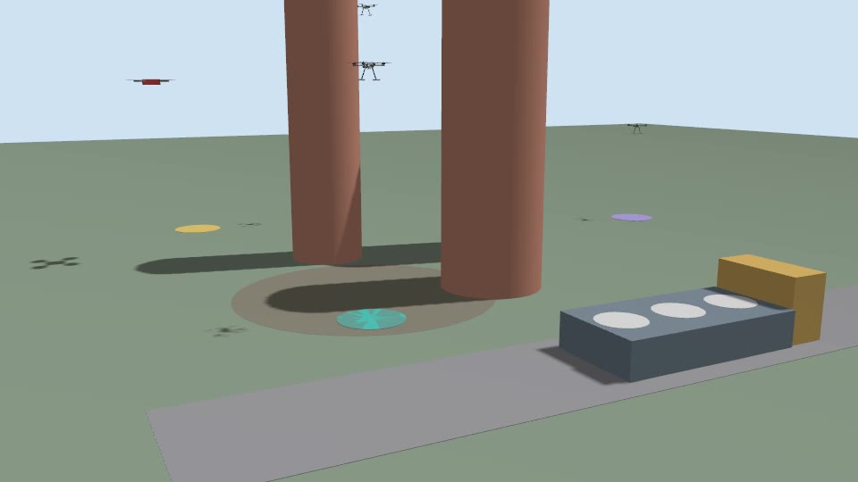
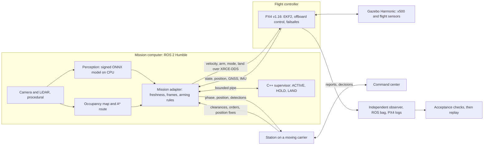

# Mission Computer Lab

[](https://github.com/buicongnguyen/mission-computer-lab/actions/workflows/ci.yml)

A drone's **mission computer** decides what it should do next; its **flight controller** keeps it in the air and owns every failsafe. This lab builds the mission-computer side of that split (a Qualcomm-class companion beside an NXP-class PX4 board) and tests it against real PX4 v1.16 firmware flying Gazebo x500s. ROS 2 carries typed messages over XRCE-DDS, a C++17 supervisor gates mission intent on the freshness of every sensor, and PX4 takes over whenever the companion fails. Faults are injected on purpose, and every flight is judged from independently recorded telemetry.

The same stack flies three drones from a moving carrier, and **guardian drones** that warn early, keep clear of intruders and cope with jamming and GNSS spoofing, with authority split between each drone, the station and a command center. They are non-kinetic by design.

**[Watch the recorded flights in the browser](https://buicongnguyen.github.io/mission-computer-lab/)**: 2D, 3D and Gazebo video, no install.



*A still from the `guardian_jamming` flight's published close-up video: the red intruder comes in from the left, the guardians fly overhead, and the carrier drives along its road to a stop clear of the intruder's path.*

## Results

| Layer | Result | Evidence |
|---|---|---|
| PX4 flights: four single-drone, the fleet, eight guardian scenarios | **13/13 pass**, 456/456 named checks, runtime inputs unchanged (30 September 2026) | [Results](docs/results.md), [replays](https://buicongnguyen.github.io/mission-computer-lab/) |
| Guardian designs, fast simulator | 4 designs × 8 threat scenarios × 40 seeds; both safety invariants held in all 1280 runs | [Guardian results](docs/guardian-results.md) |
| Fast policy harness | 8/8 fault scenarios; 6/6 signed-artifact cases | [Execution report](docs/execution.md) |
| Tests | 1 C++ contract program, 102 Python unit and process tests, 68 ROS boundary and runner tests, 6 browser page tests, all in CI | [CI workflow](.github/workflows/ci.yml) |

## How each failure is handled

| Injected failure | Who responds | Response | In the published flights |
|---|---|---|---|
| Camera frames stop for 0.8 s | Mission computer: the C++ supervisor | HOLD in place, then ACTIVE once fresh frames have stayed healthy through the recovery dwell | HOLD 0.80 s (wall clock) after the runner signalled the dropout; ACTIVE again 1.7 s later; mission completed |
| Mission computer killed | Flight controller: PX4 | Offboard-loss failsafe after its 0.5 s timeout, then lands | PX4 failsafe 0.99 s after the kill; landed and disarmed |
| GNSS fix lost | Mission computer | HOLD, then LAND when the fault persists | HOLD 0.78 s and LAND 4.2 s after the fix was lost; landed and disarmed |
| One guardian's link jammed | That guardian, on board | Holds, then keeps clear of the intruder on its own authority | Never closer than 5.44 m to the intruder (safe radius 1.5 m); link back after it left the zone |
| GNSS dragged off on every receiver | Station | Flags the drift against its own datalink fixes; guardians fly on those fixes | Flagged 10 s after the drag began; no guardian more than 1.41 m from its post |
| Command center unreachable | Station, under delegation | Keeps protecting, and recovers the guardians only after the 20 s center timeout | Recovery 20 s after the request |
| Fast object diving on the carrier | Station, then each guardian | Declares the impact area; guardians disperse out of it | RED 1.9 s before impact; the nearest guardian 5.9 m from the impact point at impact (post 3.6 m) |

## Architecture



The supervisor never commands the aircraft directly: it returns a mode and a bounded velocity, and the adapter hands control to PX4 for good on landing, failsafe, disarm, estimator loss or a pilot's mode change. [Architecture and contracts](docs/architecture.md) and [the guardian design](docs/guardian.md) go further.

## Quick start

**Watch it** with nothing installed: [the replays](https://buicongnguyen.github.io/mission-computer-lab/).

**Fast suite** on Ubuntu 22.04 with Python 3.10, in a few minutes and without ROS:

```bash
bash scripts/bootstrap_wsl.sh
.venv/bin/python -m pip install -r requirements.lock.txt
bash scripts/run_all.sh
```

**Real PX4 flights**, after the one-time install and build in [the SITL guide](docs/sitl-guide.md):

```bash
bash scripts/run_sitl.sh --all --video --output ~/work/mission-computer-lab/retests/my-run
~/work/mission-computer-lab/venv/bin/python tools/publish_sitl.py --input ~/work/mission-computer-lab/retests/my-run
```

`--all` flies the four single-drone scenarios, the fleet and the eight guardian scenarios, in about 31 minutes with `--video`; `--scenario guardian_jamming` (or any other) flies one, and `--gui` opens the live Gazebo window. Run one instance at a time, with no flight hardware attached.

**Guardian evaluation**, standard library only, about a minute on eight cores:

```bash
python3 tools/guardian_sim.py --seeds 40 --workers 8 --output artifacts/guardian
```

## What is built here

| Layer | Built in this repository | Configured | Used as-is |
|---|---|---|---|
| Flight control | C++ supervisor; ROS 2 mission adapters for one drone, the fleet and the guardians; handoff rules | PX4 failsafe and link-loss parameters; three instances with their own namespaces and system IDs | PX4 v1.16 firmware: EKF2, offboard control, failsafes, land detector |
| Simulation | Inspection world; carrier with pads and cameras; a guardian world written per scenario; procedural camera and LiDAR | Gazebo recording cameras, the ROS bridge, simulation time | Gazebo Harmonic physics and flight sensors; the x500 model |
| Middleware | Typed ROS interfaces; station, center and environment nodes | XRCE-DDS domain and QoS | ROS 2 Humble, Micro XRCE-DDS Agent, `px4_msgs` |
| Autonomy | A* with scan-driven replanning; the guardian decision module (tracking, posture, keep-clear, dispersal, authority) and its simulator | | |
| AI and security | Hand-authored ONNX graph; signed model release and boot gate | CPU execution provider | ONNX Runtime; `cryptography` (Ed25519) |
| Evidence | Flight runner, acceptance checks, provenance, publisher, replays | CI jobs | three.js, Mermaid |

## Known limits

- **Payload and AI:** the camera and LiDAR are procedural ROS publishers and the model is a hand-authored brightness segmenter on CPU. Perception freshness gates mission health; detections never steer the drone. No trained detector, NPU execution or VIO is claimed.
- **One host:** every vehicle, the station and the center share one machine and one DDS domain. Radio links, their loss and latency, and DDS security are not modelled.
- **Moving deck:** PX4 reads a drone resting on the driving carrier as GNSS drift, which would block re-arming there. Launching again from a moving vehicle needs an aircraft-level design; [the SITL guide](docs/sitl-guide.md) explains why and lists the options.
- **Fast threats:** against a fast object diving on the carrier there are one or two seconds of warning. A guardian hovering over the impact point of a 250 m/s object escapes in only 10% of simulated runs; offsetting it fixes most of that. That is physics and layout, not software.
- **Separation:** vehicles keep apart by altitude layers 1.5 m apart, pads 1.1 m apart and landing lowest layer first. Nothing deconflicts them live from each other's positions.
- **Straight-line prediction:** keep-clear moves assume threats fly straight, and weaving threats at long range defeat that; [the guardian results](docs/guardian-results.md) measure it on truth.
- **Battery** is fixed at a simulated 95% in the flight adapter; low battery is tested in the fast harness.
- The PX4/Gazebo flights run locally in WSL; CI runs everything else. Nothing here is a flight qualification or a safety, security or aerospace certification, and no credentials or production signing keys are included.

## Next on real hardware

1. **Hardware in the loop:** the same adapter against an NXP flight controller over its serial or Ethernet XRCE-DDS link, then tethered flights.
2. **Real payload:** camera and LiDAR drivers with hardware timestamps and calibration, and a trained detector on the Qualcomm NPU through the QNN execution provider, profiled for latency, power and temperature against the supervisor's budget.
3. **Boot trust in hardware:** the model's public key in protected storage, secure boot, and a persistent anti-rollback counter.
4. **Links:** DDS security (SROS 2), and measured radio loss and latency between the vehicles, the station and the center.
5. **Deck operations:** relative positioning on the pad (RTK or vision), and a decision on EKF2's GNSS checks for a moving deck.
6. **Real threat sensors** (radar, EO/IR, RF) and authenticated friendly identification in place of the simulated ones.

## Read more

| | |
|---|---|
| [Results](docs/results.md) | Every figure above, with its source |
| [Engineering findings](docs/findings.md) | Eighteen things that building and flying this taught |
| [Architecture and contracts](docs/architecture.md) | Data path, supervisor protocol, state machine, threat model |
| [Guardian drones](docs/guardian.md) | The idea evaluated and improved twice, the design, its evaluation and its PX4 flights |
| [SITL guide](docs/sitl-guide.md) | Install, run, topics, acceptance checks and troubleshooting |
| [Review record](docs/review-report.md) | Ten review passes: each finding with its fix and test |
| [Domain notes](docs/domain-notes.md) | How the pieces map to Qualcomm, NXP and PX4 practice |

## How the project maps to mission-computer work

| Area | Implemented and tested here | Still needs real hardware |
|---|---|---|
| Autonomy: perception, fusion, planning, navigation | Procedural camera to ONNX Runtime inference; planar LiDAR to an occupancy map grown from every scan, then A* that replans when a newly seen obstacle closes the route; PX4 EKF2 in SITL; an educational Kalman filter in the fast harness | Trained detector, VIO/SLAM, moving-obstacle avoidance |
| ROS 2 middleware and PX4 integration | Typed interfaces (`ros2/mission_interfaces`), best-effort sensor QoS, versioned PX4 topics over XRCE-DDS, offboard velocity control, command ACKs, MAVLink GCS heartbeat | NXP flight-controller hardware link and transport tuning |
| Multi-sensor integration | Camera, LiDAR, GNSS and IMU freshness contracts; ENU/NED conversion; replay-safe capture timestamps; fix-validity checks | Calibration, extrinsics, hardware timestamping |
| Reliability and failure ownership | HOLD/LAND supervisor with dwell times and intermittent-fault escalation; permanent handoff to PX4 on failsafe, disarm, estimator loss or operator mode change; companion-crash failsafe | Hardware-in-the-loop and flight qualification |
| AI/ML deployment | CPU execution provider selected and recorded; latency budget enforced by the supervisor | QNN/NPU conversion, quantization, profiling, power and thermal |
| Platform security | Signed artifact manifest (hash, version floor, device identity) verified from disk at boot; six tamper, rollback and identity cases; threat model | Boot ROM, fuses, TEE, protected key provisioning, persistent anti-rollback |
| Multi-vehicle operations | Three PX4 instances with per-vehicle namespaces and system IDs; a station on a moving carrier that grants launches and landings; altitude layering; lead-compensated landing on a moving deck with go-around | Radio links, relative positioning on the deck, deck motion, wind, airspace procedures |
| Threat awareness and protection | Multi-sensor track fusion with camera classification; posture, keep-clear and dispersal decisions split between drone, station and center by time budget; lost-link procedures; a GNSS spoofing cross-check; a seeded evaluation of four designs and eight PX4 guardian flights | Real sensors and their performance, authenticated links, rules of engagement, and anything that responds to a threat |
| Telemetry and diagnostics | An independent observer per vehicle, JSONL logs, ROS bags, PX4 logs, station logs, run-time provenance hashes | Fleet telemetry at scale and on-target diagnostics |
| DevOps and testing | CMake/CTest, unittest suites, ROS tests in a Humble container, lint and format checks, a docs drift check, evidence gates | Target image builds (Yocto/BSP) |

## Repository map

| Path | Purpose |
|---|---|
| `src/`, `include/` | C++ supervisor, validation and process protocol |
| `integration/`, `ros2/` | ROS nodes (vehicle adapters; fleet and guardian station, environment and center), typed interfaces, the flight runner and its acceptance checks |
| `tools/` | Sensors, perception, estimator and planner, security, the guardian decision module and simulator, provenance, publishers |
| `simulation/` | Gazebo worlds: inspection, the fleet with its moving carrier, and the guardian template |
| `tests/` | Policy, model, planning, localization, security, transport, acceptance and evidence tests; browser page tests |
| `scripts/` | WSL bootstrap, SITL install and build, one-command verification |
| `web/` | Replay pages (2D, 3D, video) driven by recorded results; three.js vendored in `web/vendor/` |
| `artifacts/` | Compact reference evidence for the replays and the guardian evaluation |
| `docs/` | Results, findings, architecture, guides, domain notes, references and the review record (Markdown with rendered HTML) |

Python dependencies are pinned in `requirements.lock.txt` (fast suite) and `requirements-sitl.lock.txt` (flight stack).

## References

The core open-source stack, pinned to the versions the evidence was recorded with. [The full reference list](docs/references.md) adds the tooling libraries, the upstream guides followed, and the Qualcomm and NXP platform documentation.

| Project | Version | Source | Documentation |
|---|---|---|---|
| PX4 Autopilot | v1.16.0 | [PX4/PX4-Autopilot](https://github.com/PX4/PX4-Autopilot/tree/v1.16.0) | [docs.px4.io/v1.16](https://docs.px4.io/v1.16/en/) |
| px4_msgs | release/1.16 | [PX4/px4_msgs](https://github.com/PX4/px4_msgs/tree/release/1.16) | [uXRCE-DDS bridge](https://docs.px4.io/v1.16/en/middleware/uxrce_dds) |
| Micro XRCE-DDS Agent | v2.4.3 | [eProsima/Micro-XRCE-DDS-Agent](https://github.com/eProsima/Micro-XRCE-DDS-Agent/tree/v2.4.3) | [micro-xrce-dds.docs.eprosima.com](https://micro-xrce-dds.docs.eprosima.com/) |
| ROS 2 | Humble | [ros2/ros2](https://github.com/ros2/ros2) | [docs.ros.org/en/humble](https://docs.ros.org/en/humble/) |
| Gazebo | Harmonic | [gazebosim/gz-sim](https://github.com/gazebosim/gz-sim), [PX4/PX4-gazebo-models](https://github.com/PX4/PX4-gazebo-models) | [gazebosim.org](https://gazebosim.org/docs/harmonic/getstarted/) |
| ONNX Runtime | 1.20.1 | [microsoft/onnxruntime](https://github.com/microsoft/onnxruntime) | [onnxruntime.ai](https://onnxruntime.ai/) |
| MAVLink | pymavlink 2.4.49 | [mavlink/mavlink](https://github.com/mavlink/mavlink) | [mavlink.io](https://mavlink.io/en/) |
| three.js | 0.147.0 | [mrdoob/three.js](https://github.com/mrdoob/three.js/tree/r147) | [threejs.org](https://threejs.org/docs/) |
