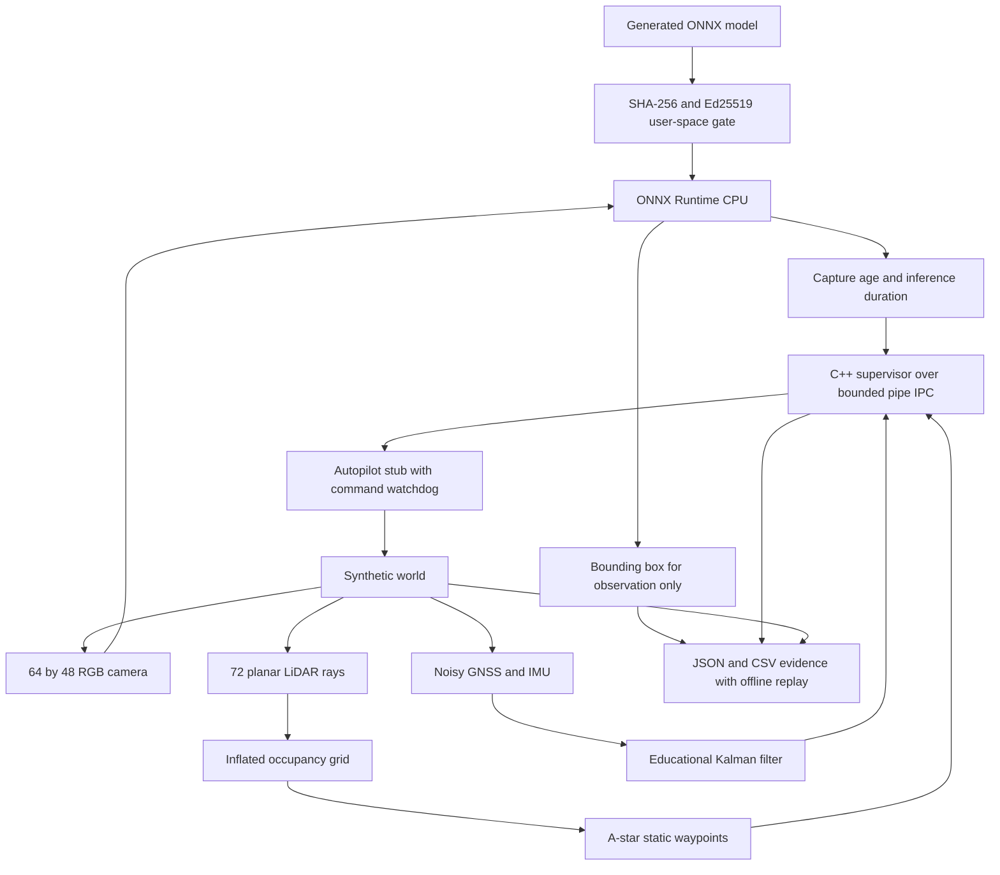
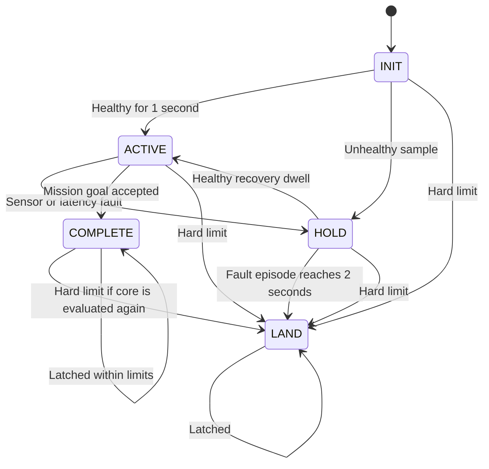

# Mission Computer Lab: architecture and contracts

This repository implements two WSL/Linux test environments for a benign inspection mission: a fast kinematic policy harness and an actual PX4/Gazebo/ROS 2 integration. It does not emulate the Qualcomm SoC. The diagram and component table below describe the fast harness; [the SITL guide](sitl-guide.md) specifies the real firmware integration, topic contracts, frames and failsafe ownership.

## Fast harness data path

This data-flow diagram shows which outputs influence motion and which are recorded as payload observations.



The text equivalent below remains useful in terminals and Markdown viewers without Mermaid support.

```text
Generated ONNX artifact
      │ SHA-256 + Ed25519 signature + version/device checks
      ▼
User-space boot gate ──► ONNX Runtime CPU session
                              ▲                 │ mask → synthetic object bbox
Synthetic world ──► RGB camera┘                 ▼
       ├─────────► planar LiDAR ─► inflated occupancy ─► A* waypoints
       ├─────────► noisy GNSS ─┐                         │
       └─────────► noisy IMU ──┴─► Kalman localization ──┤
                                                       ▼
                         Python ── local process IPC ─► C++17 supervisor
                                                       │ bounded ENU velocity
                                                       ▼
                            Independent autopilot stub + kinematic vehicle
                                                       │
                    JSON / CSV / events / actual camera frames / browser replay
```

Perception is an observed payload branch: its freshness and latency affect supervision, but its bounding box does not steer the vehicle. LiDAR builds the occupancy map for A*; every later scan is added, and the route is replanned if it closes. The planner is not doing visual pursuit, dynamic obstacle avoidance or SLAM.

## Component boundaries

| Component | Implementation | Assumptions and limitations |
|---|---|---|
| Boot gate | `tools/security.py` | A release step signs the stored model and writes a detached manifest and signature. Boot reads the file once, verifies it against a separately supplied Ed25519 public key and loads only those verified bytes; an unsigned or modified model stops the perception node. The key is ephemeral per run. ROM and kernel stages are labels, not emulation. |
| Camera | `tools/perception.py` | 64 × 48 RGB, 10 Hz, fixed synthetic background and moving bright silhouette. No camera extrinsics or photorealism. |
| ONNX detector | Same module; opset 13, IR 8 | ReduceMean + Greater segmentation. One CPU thread. Untrained and deliberately tiny. |
| LiDAR | `tools/world.py` | 72 ideal planar rays, 14 m range. Circular obstacles; no occlusion noise, material effects or 3-D geometry. |
| Map and planner | Same module | Scans accumulate into a 1 m grid with 1 m return inflation; four-neighbor A* replans when a new scan blocks the remaining route. A single scan from the origin cannot see the mostly occluded (6,6) cylinder, so replanning is required for safety, not an optimization. Static obstacles only; no moving-obstacle prediction. |
| Localization | Same module | Six-state position/velocity Kalman filter, known world-frame acceleration, 5 Hz noisy GNSS. No attitude, gravity, bias estimation, VIO or true GPS-denied navigation. |
| Supervisor | `include/supervisor.hpp`, `src/supervisor.cpp` | 20 Hz simulated evaluation; freshness, sequence/range validation, speed/geofence limits, recovery dwell and latched landing. |
| Process transport | `src/main.cpp`, `tools/run_demo.py` | Real Python/C++ pipes, line-delimited numeric contract. No network authentication, MAVLink or DDS. |
| Autopilot stub | Harness | Integrates commanded velocity; retains an independent command-age watchdog for the explicit crash scenario. No attitude/rate loops, motor dynamics or wind. |
| Evidence/UI | Harness and `web/` | Recorded events and metrics; browser playback is offline, not flight telemetry. |

## Clock, units and frames

The simulation advances in fixed 0.05 s steps and runs faster than wall time. Every synthetic sensor timestamp uses the same simulation clock. WSL wall-clock duration is used only to measure ONNX calls and supervisor IPC. These clocks must not be mixed when interpreting failure latencies.

All motion uses **ENU**: x east, y north, z up, metres and metres/second. The tested `enu_to_ned` helper maps `(x,y,z)` to `(y,x,-z)`. A real PX4 adapter also needs body-frame conventions, orientation conversion and timestamp handling. Applying only this vector swap to every message would be wrong.

Camera timestamps are capture times; the current graph's measured inference duration is stored separately. The overload scenario injects a **reported** 120 ms duration. It does not sleep for 120 ms or model CPU/NPU contention. LiDAR raycasts use truth for the ideal sensor geometry; that shortcut means this is not a SLAM evaluation.

## Supervisor protocol

One input line has exactly 15 space-separated fields:

```text
sequence now imu_stamp gnss_stamp vision_stamp link_stamp battery
pos_e pos_n pos_u target_e target_n target_u inference_ms complete
```

The line above wraps for readability; the wire frame must be one line. `complete` is 0 or 1. Sequence and `now` must increase strictly. Sensor timestamps must be nonnegative and no later than `now`. Battery is a fraction in [0,1]. Nonfinite numbers, invalid ranges, extra fields or replayed frames terminate the process with code 2 and emit no command for that frame.

One output line contains:

```text
sequence mode reason velocity_e velocity_n velocity_u
```

The runner correlates sequence numbers and imposes a three-second wall-clock response timeout. Unexpected transport failure aborts the experiment. The explicit `companion_crash` injection exercises a separate stub watchdog; this is not a general production process supervisor.

## Health policy and state machine



This is the C++ policy graph. A fault episode starts at the first unhealthy sample and ends only after 2 s of continuous health, so a link or sensor that keeps dropping out escalates to LAND instead of alternating between HOLD and brief ACTIVE commands. In the ROS adapter, LAND or COMPLETE transfers control to PX4 once and permanently stops core evaluation and offboard streaming. PX4 then owns touchdown and disarm, so landing estimator noise cannot start a new application transition. The adapter also hands off permanently if a pilot or GCS leaves OFFBOARD after it was entered; it never switches the vehicle back.

| Policy | Value in the prototype | Rationale |
|---|---:|---|
| Healthy preflight dwell | 1.0 simulated second | Avoid immediate autonomous motion at startup |
| IMU freshness | 0.15 s | Three 20 Hz ticks |
| GNSS freshness | 0.50 s | Tolerate more than one 5 Hz interval |
| Camera freshness | 0.30 s | Tolerate short 10 Hz disruption |
| Link freshness | 0.50 s | Demonstrate telemetry loss handling |
| Reported inference budget | 50 ms | Illustrative budget, not an IQ9 benchmark |
| Recovery dwell | 0.50 s | Prevent rapid mode oscillation |
| Fault episode before LAND | Any unhealthy sample 2.0 s or more after the episode began; 2.0 s of continuous health ends the episode | Escalate sustained and intermittent faults; latch |
| Autopilot-stub command loss | Older than 0.50 s | Independent companion-crash behavior |
| Speed limit | 2 m/s norm | Bound mission intent |
| Operating envelope | Horizontal radius 20 m; target altitude 0–12 m | Small synthetic test world |
| Low battery | Below 20% | Immediate latched LAND |

These are design choices for the lab; they are not values prescribed by a program requirement or safety-qualified flight limits.

```text
INIT ── healthy dwell ──► ACTIVE ── mission done ──► COMPLETE
  │                         │
  └── unhealthy ──► HOLD ◄───┘
                      │  └── healthy recovery dwell ──► ACTIVE
                      └── fault episode ≥ 2 s ──► LAND (latched)
Any state ── hard limit / low battery ────────► LAND
```

HOLD outputs zero velocity in this ideal plant. It does not prove that a real aircraft can hold position when its estimator is invalid. LAND is a descent between 0.3 and 0.7 m/s that continues until touchdown is detected, even when a drifted estimate already reads zero altitude; actual actions must depend on estimator validity, environment and autopilot policy. COMPLETE remains stationary at the final waypoint. The harness also applies truth-based ground contact; that is simulator mechanics, not an available real-world sensor.

## Threat model and implemented evidence

| Boundary / failure | Control or response | Test evidence | Residual limitation |
|---|---|---|---|
| Modified model bytes | SHA-256 bound into signed manifest; boot verifies the stored file and loads only the verified bytes | Tampered, unsigned and wrong-anchor stored models rejected; SITL perception refuses to start | A local attacker can replace this verifier or the unprotected public-key file |
| Forged signature or edited metadata | Ed25519 over canonical manifest | Wrong signer and modified version rejected | No protected key storage or device enrollment |
| Old authorized artifact | Minimum version check | Signed version 1 rejected at floor 2 | Floor is supplied in software, not persistent tamper-resistant state |
| Artifact for another board | Signed device field | Device mismatch rejected | Demo identity is a string, not hardware identity |
| Replayed/bad sensor frame | Monotonic sequence/time and finite/range checks | Unit and process tests | Pipe endpoint is trusted; no sender identity |
| Stale GNSS, IMU, camera or link | HOLD then recovery or LAND; intermittent faults escalate too | Scenario traces; degraded-link contract test | No redundant estimator or radio modeling |
| Companion process death | Stub watchdog in fast tests; independent PX4 failsafe in SITL | Actual subprocess/process-group kill scenarios | Software simulation only; no physical aircraft qualification |
| RF interference / spoofing | Outside executed scope | Design discussion only | Requires controlled RF/GNSS test facilities and threat-specific requirements |

This is artifact verification, not an OTA updater. It has no download transport, A/B partition handling, power-loss recovery, rollback counter persistence, certificate rotation or hardware root of trust.

## Evidence and acceptance criteria

The executable suite includes one CTest program with multiple supervisor checks, 35 Python unit/integration tests, eight scenario runs, and six signed-artifact cases. Tests fail the run on unexpected terminal mode, collision with a modeled obstacle, excessive estimator error, missing required transitions, malformed evidence or failed update checks.

The eight scenarios cover nominal completion; recoverable camera loss and inference overload; sustained GNSS, link and IMU loss; low battery; and an actual supervisor-process kill. Every scenario records events, sampled states, camera frames, LiDAR endpoints, measurements and checks. The [execution report](execution.md) contains the observed values.

The current error bound is a deliberately loose 2 m check on this small synthetic world. Collision checks are sampled circular-obstacle clearance checks, not continuous swept-volume validation. A fixed random seed makes sensor noise reproducible, while timing measurements remain machine/load dependent.

## Production migration sequence

1. Completed in the integration track: add PX4 SITL and validate coordinate frames, modes, acks and loss behavior.
2. Completed in the integration track: add typed ROS 2 messages and explicit QoS around the C++ process boundary; retain the supervisor's policy tests.
3. Replace synthetic perception with licensed recorded data and a trained model with separate accuracy evaluation.
4. Replace the simple estimator with a validated localization stack and calibrated sensor timing/extrinsics.
5. Deploy to the exact Qualcomm board/BSP; verify supported accelerator operators, numerical outputs and device measurements.
6. Integrate vendor boot/provisioning/update flows with protected keys and recovery design. Keep manufacturing changes distinct from mission application changes.

Each replacement should preserve one reference input/output trace and add tests at the newly real boundary. Hardware success cannot be inferred from the WSL results.
