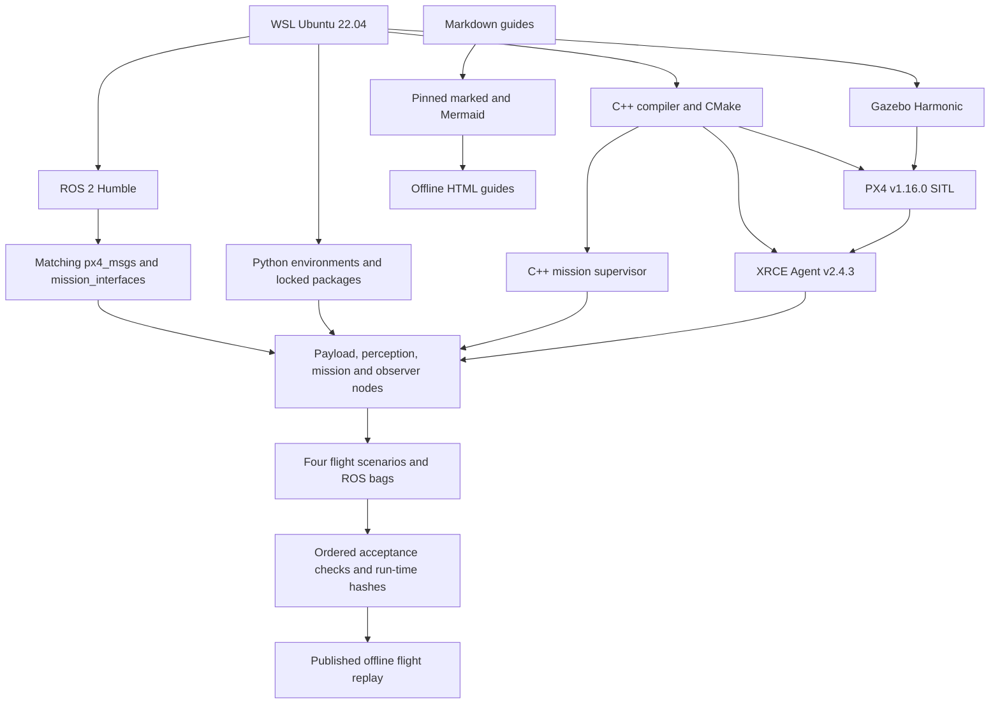
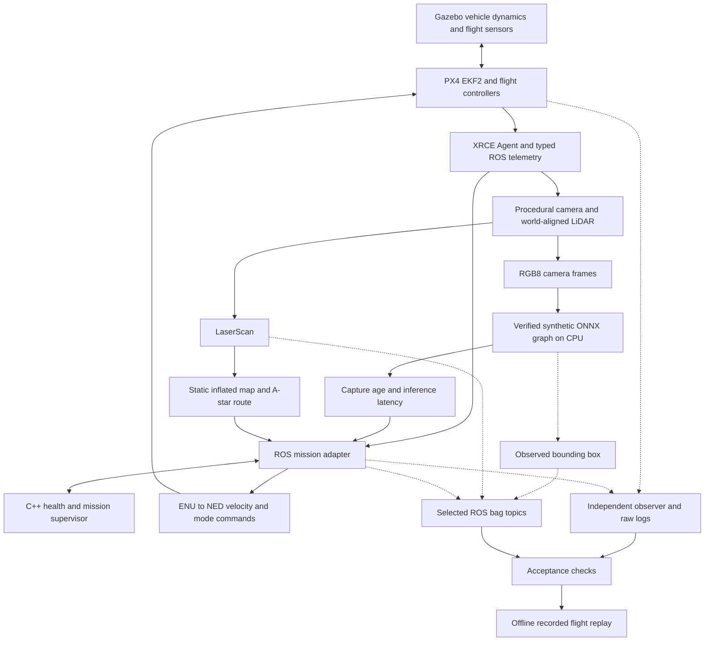

# Complete work record and step-by-step reproduction guide

Prepared on 22 September 2026 and reviewed in four passes on 23–24 September 2026 for the WSL-only mission-computer lab. This document records what was built, why each component exists, the problems encountered, the fixes, and the commands you can use to reproduce the tests yourself.

**If the flight stack is already built, start with section 3.** Otherwise follow section 4 first. You do not need Qualcomm hardware, a flight controller, a GPU, Docker, or a Gazebo window to run these tests.

The current files include the fixes from four review passes; see [the review record](review-report.md) for changes and retest evidence.

## Contents

1. [What was built](#completed)
2. [Environment, folders and versions](#environment)
3. [Rerun everything on a prepared computer](#quick-rerun)
4. [Rebuild the environment from the beginning](#fresh-setup)
5. [Regenerate the documentation](#documents)
6. [Understand the complete running pipeline](#pipeline)
7. [Run and inspect the lightweight tests](#lightweight)
8. [Run and inspect the real PX4 flight tests](#flight-tests)
9. [Inspect live ROS interfaces and recorded bags](#ros-inspection)
10. [Read the evidence and compare your results](#evidence)
11. [Publish your new replay and regenerate HTML](#publish)
12. [Debugging history: what failed and how it was fixed](#debugging)
13. [Stop, recover and rerun safely](#recovery)
14. [Understand each important source file](#source-map)
15. [Repeatable change-and-test workflow](#workflow)
16. [Boundaries, unfinished work and references](#boundaries)

<a id="completed"></a>
## 1. What was built

### 1.1 Researched the platform boundaries

The design starts from the responsibilities of a Qualcomm-based mission computer paired with an NXP-based PX4 flight controller: mission-computer integration, platform/security work, sensor and AI deployment, and dependable communication with a separate flight controller. Qualcomm IQ9 is the target family; an RB5 is an architectural reference, not an interchangeable target. The source-linked discussion is in [the domain notes](domain-notes.md).

### 1.2 Built a small, fast test environment first

The first implementation contains a C++17 mission supervisor, Python virtual sensors, a real ONNX Runtime CPU session, a simple localization filter, LiDAR-based A* planning, a kinematic vehicle model, artifact-signature checks, automated tests, and an offline browser replay.

This gives quick feedback without compiling or launching PX4. It exercises eight scenarios and six signed-artifact cases. Its independent autopilot is a Python stub; its motion is simplified. Its evidence is distinct from the later firmware integration.

### 1.3 Added the actual flight stack

I installed ROS 2 Humble and Gazebo Harmonic in Ubuntu 22.04 WSL, built PX4 v1.16.0 and Micro XRCE-DDS Agent v2.4.3, and built the matching ROS message packages.

I then added a Gazebo inspection world, ROS payload and inference nodes, a ROS adapter around the C++ supervisor, a local MAVLink GCS heartbeat, an independent observation process, selected-topic ROS bag recording, a process orchestrator, and a flight-evidence replay.

The completed system runs actual PX4 firmware in software-in-the-loop (SITL). Gazebo supplies the x500's physical dynamics and flight sensors. The mission software requests offboard mode, arms through PX4's command interface, climbs to 3 m, follows an inspection route, requests landing, and observes disarming. It does not bypass the arming checks with a force-arm command.

### 1.4 Injected faults and checked outcomes

| Validation layer | Recorded result | What it establishes |
|---|---|---|
| C++ CTest suite | 1 test executable passed, with multiple assertions | Supervisor contracts, state behavior and coordinate helper |
| Lightweight Python tests | 28 passed after review | Perception, planning, localization, security and process-input behavior |
| Lightweight scenarios | 8 passed | Policy responses in the kinematic model |
| Signed-artifact experiments | 6 behaved as expected | Valid acceptance and rejection of selected integrity/policy failures |
| ROS integration regression tests | 14 passed after review | GPS validity, timestamp replay, topic/QoS contracts, operator takeover, estimator restart and JSON serialization |
| Actual PX4/Gazebo flight scenarios | 4 passed | Nominal flight, camera recovery, independent crash failsafe and GPS fix-loss landing |
| C++ sanitizer build | Built; CTest passed | Checked C++ test execution with address/undefined-behavior sanitizers |
| Two dashboard state tests | Passed | Scenario selection, timeline/events and play/pause behavior |
| Static documentation checks | Passed | Local links, HTML metadata and referenced DOM IDs |

The current 54 Python tests are 35 lightweight tests plus 19 ROS/runner regression tests. The original implementation had 14 plus 5; the additional cases cover the review findings. The six security experiments are also exercised by the lightweight workflow; these counts are different layers of evidence, not a claimed coverage percentage.

### 1.5 Reviewed and packaged the evidence

The [review record](review-report.md) documents four review passes. They add transport deadlines, payload freshness validation, permanent landing handoff, stricter evidence gates, run-time provenance, process cleanup fixes, intermittent-fault escalation, verification of the stored signed model at boot, operator-takeover handoff and five Mermaid diagrams. That record includes commands for independently rerunning the review checks.

The repository includes domain notes, an architecture guide, runbooks, recorded evidence and two offline replays. A GitHub Actions workflow covers the lightweight suite and documentation checks. Browser state and link checks passed; visual HTML layout review inside the embedded browser was blocked by its local-file URL policy and was not completed.

<a id="environment"></a>
## 2. Environment, folders and versions

### 2.1 Keep the two shells separate

**PowerShell commands run in Windows. Bash commands run inside Ubuntu WSL.** Do not paste `sudo`, `source`, or `/mnt/c/...` commands into PowerShell. Do not paste `C:\...` paths into Bash as if they were Linux paths.

| Purpose | Windows view | Ubuntu WSL view |
|---|---|---|
| Project source (example) | `C:\src\mission-computer-lab` | `/mnt/c/src/mission-computer-lab` |
| Lightweight Python environment | `.venv` inside project; Linux executables | `$DRONE_REPO/.venv` |
| C++ core binaries | `build` inside project | `$DRONE_REPO/build` |
| Large flight-stack workspace | Inside Ubuntu's Linux filesystem | `~/work/mission-computer-lab` |
| Flight-stack Python environment | Inside Ubuntu | `$SITL_WORKSPACE/venv` |
| ROS workspace | Inside Ubuntu | `$SITL_WORKSPACE/ros_ws` |
| New run evidence | `artifacts` inside project | `$DRONE_REPO/artifacts/<your-run>` |
| PX4 working directories and ULogs | Inside Ubuntu | `$SITL_WORKSPACE/runs/<scenario>-<timestamp>` |

The scripts determine the source repository from their own location. The default large workspace is `$HOME/work/mission-computer-lab`. `SITL_WORKSPACE` can override it, but then you must use that same value for builds, runs, ROS sourcing and publication. Do not copy Linux virtual environments or CMake caches to another path; recreate them there.

### 2.2 Recorded versions

| Component | Tested version or revision |
|---|---|
| Linux distribution | Ubuntu 22.04.5 LTS under WSL2, x86-64 |
| Python | 3.10.12 |
| GCC | 11.4 |
| Ubuntu CMake used for the large build | `/usr/bin/cmake`, 3.22.1 |
| ROS | Humble; recorded `ros-humble-ros-base` package `0.10.0-1jammy.20260908.101203` |
| Gazebo | Harmonic; metapackage `gz-harmonic` `1.0.0-1~jammy` |
| PX4 | v1.16.0, `6ea3539157ca358c70a515878b77077af7d4611d` |
| PX4 ROS messages | release/1.16, `392e831c1f659429ca83902e66820d7094591410` |
| Micro XRCE-DDS Agent | v2.4.3, `73622810d984349b80bbac0ef55fc0b694d62222` |
| NumPy / ONNX / ONNX Runtime | 1.26.4 / 1.17.0 / 1.20.1 |
| cryptography / pymavlink | 44.0.3 / 2.4.49 |
| Markdown renderer | marked 17.0.5; Node.js 20 or newer required by the project |

The full Python pins are `requirements.lock.txt` and `requirements-sitl.lock.txt`. The latter records packages local to the flight-stack virtual environment; ROS Python dependencies such as `rclpy` and `empy` come from apt through `--system-site-packages`. Do not try to install `rclpy` from this lock file into a Windows Python environment.

The source revisions are pinned, but the apt installer uses the configured repositories' available packages; it is not an immutable OS image. A future fresh installation can therefore have different apt dependency versions. Compare the resulting environment with the recorded report if behavior changes. The Gazebo metapackage version is not the version of every Gazebo library.

The prepared large workspace measured about **3.5 GB** when this guide was written. WSL had roughly 15 GB of memory available during development. Allow additional storage for downloads, build intermediates and repeated bags/ULogs; around 10 GB free is a practical margin, not a measured minimum requirement. The build limits compiler concurrency to three jobs.

<a id="quick-rerun"></a>
## 3. Rerun everything on a prepared computer

This is the path to use first. It does not reinstall ROS, Gazebo or PX4, and it preserves the committed reference samples until you explicitly publish new ones.

### Step 3.1 — Open Ubuntu

**Windows PowerShell:**

```powershell
wsl --list --verbose
wsl -d Ubuntu-22.04
```

Confirm the distribution is `Ubuntu-22.04` and its WSL version is 2. If you open a Windows Terminal tab directly into Ubuntu, skip the second command.

### Step 3.2 — Set the working paths

**Ubuntu Bash, terminal A:**

```bash
export DRONE_REPO=/mnt/c/src/mission-computer-lab   # your checkout
export SITL_WORKSPACE="$HOME/work/mission-computer-lab"
cd "$DRONE_REPO"
export PATH="/usr/bin:$PATH"
set -o pipefail
export DRONE_RETEST="$DRONE_REPO/artifacts/retest-$(date +%Y%m%d-%H%M%S)"
mkdir -p "$DRONE_RETEST"
pwd
```

`DRONE_RETEST` gives this attempt a new directory. Keep this terminal open; later commands use that variable. On a new terminal, set it again to the exact existing run path if you want to inspect that run. `pipefail` makes failures visible even when output is also written through `tee`.

### Step 3.3 — Confirm the prepared files exist

```bash
(
set -e
test -x .venv/bin/python
test -x build/mission_supervisor
test -f /opt/ros/humble/setup.bash
test -f "$SITL_WORKSPACE/ros_ws/install/setup.bash"
test -x "$SITL_WORKSPACE/agent-install/bin/MicroXRCEAgent"
test -x "$SITL_WORKSPACE/PX4-Autopilot/build/px4_sitl_default/bin/px4"
"$SITL_WORKSPACE/venv/bin/python" -m pip check
echo 'Prepared environment verified.'
)
echo "Environment-check exit code: $?"
```

Successful `test` commands print nothing and return zero. The subshell stops on the first missing prerequisite without closing your interactive terminal. Expect `No broken requirements found.`, `Prepared environment verified.`, and exit code 0. If a file is absent or the exit code is nonzero, use section 4 for the missing setup stage before continuing.

### Step 3.4 — Run the lightweight suite

```bash
bash scripts/run_all.sh 2>&1 | tee "$DRONE_RETEST/lightweight-console.log"
echo "Exit code: $?"
```

**Expected:** CTest passes, 35 Python tests pass, eight scenarios print `PASS`, and the artifact checker reports eight scenarios and six security cases. The final exit code must be 0. If it is not, stop and inspect the captured log before publishing anything.

This command refreshes `artifacts/latest/`. The console transcript has a unique path, but the lightweight harness's default raw output directory is reused. The committed `artifacts/sample/` remains unchanged.

### Step 3.5 — Run the ROS regression tests

```bash
source /opt/ros/humble/setup.bash
source "$SITL_WORKSPACE/ros_ws/install/setup.bash"
bash scripts/test_integration.sh 2>&1 |
  tee "$DRONE_RETEST/ros-contracts.log"
echo "Exit code: $?"
```

**Expected:** `Ran 12 tests` and `OK`. These tests do not launch or arm a vehicle. If imports fail, check the sourced workspace and the explicit Python executable.

### Step 3.6 — Run the four actual flight scenarios

For long recordings, prefer a fresh Linux-filesystem output such as `$SITL_WORKSPACE/retests/$(date +%Y%m%d-%H%M%S)/flights`. The first post-review run under `/mnt/c` stopped with an OS `No data available` I/O error. That failed attempt is preserved in `artifacts/review-final/`; no pass was published from it. The retry uses `/home/n/work/mission-computer-lab/review-final-linux-v2`. If you choose a Linux output, assign its parent to `DRONE_RETEST`, create it with `mkdir -p "$DRONE_RETEST"`, and use that value consistently for the commands below.

```bash
bash scripts/run_sitl.sh --all --output "$DRONE_RETEST/flights" --timeout 150 2>&1 |
  tee "$DRONE_RETEST/flight-console.log"
echo "Exit code: $?"
```

The runner launches and cleans up all required processes itself. **Do not separately start another PX4, agent or Gazebo instance for this command.** Keep flight hardware disconnected from this lab. The configured DDS domain is 42; domain selection is not network authentication or isolation.

Expect progress approximately every 15 seconds. The sequence is `nominal`, `camera_dropout`, `companion_crash`, then `gps_loss`. The reference matrix took about 161 seconds in total; your scheduling, discovery and physics startup can differ. The timeout applies to each scenario and includes startup. The complete matrix must print four PASS results and exit 0. It stops at the first failed case.

No Gazebo GUI window is expected: the test launches the simulator headlessly. After a successful scenario, the aircraft has landed and disarmed before cleanup. The HTML replay is a separate recorded visualization.

### Step 3.7 — Print a compact results summary

```bash
"$SITL_WORKSPACE/venv/bin/python" - "$DRONE_RETEST/flights/results.json" <<'PY'
import json, sys
results = json.load(open(sys.argv[1], encoding='utf-8'))
for result in results:
    failed = [name for name, ok in result['checks'].items() if not ok]
    print(result['scenario'], 'PASS' if result['passed'] else 'FAIL',
          'seconds=', result['duration_wall_s'], 'failed_checks=', failed)
assert len(results) == 4 and all(r['passed'] for r in results)
PY
```

This reads the newly produced evidence, not the old sample. All `failed_checks` lists should be empty. A nonzero assertion exit means the complete matrix has not passed.

### Step 3.8 — Keep or publish your results

Your raw flight evidence is already saved. You can inspect it without changing the reference replay. To deliberately replace the reference samples and see your new run in the dashboards, follow section 11. Publication updates tracked evidence and summary files, so Git will show changes afterward.

<a id="fresh-setup"></a>
## 4. Rebuild the environment from the beginning

Skip this section when the prepared environment passes the checks above. These steps explain the setup that was performed and provide a reproducible route for another Ubuntu 22.04 environment.

### Step 4.1 — Choose a checkout and a Linux build workspace

You can use the existing checkout and default workspace, or create an independent source copy and build workspace. The following optional local clone does not need a GitHub remote:

```bash
mkdir -p "$HOME/work"
git clone "$DRONE_REPO" "$HOME/work/drone-project-reproduction"
export DRONE_REPO="$HOME/work/drone-project-reproduction"
export SITL_WORKSPACE="$HOME/work/mission-computer-lab-reproduction"
cd "$DRONE_REPO"
export PATH="/usr/bin:$PATH"
set -o pipefail
```

Use new directory names if those paths already exist. This clone omits ignored files: virtual environments, builds and raw test runs. A Linux-filesystem clone can make builds faster. If you use this optional path, keep using the overridden `SITL_WORKSPACE`; otherwise your later commands could accidentally source the default workspace.

On a different computer, first clone this repository. WSL installation itself was already present and was not performed during this project; use Microsoft's [WSL installation instructions](https://learn.microsoft.com/en-us/windows/wsl/install) if necessary, selecting Ubuntu 22.04 for this tested stack.

### Step 4.2 — Install only the lightweight prerequisites first

**Ubuntu Bash:**

```bash
sudo apt-get update
sudo apt-get install -y --no-remove build-essential cmake python3-venv python3-pip git
bash scripts/bootstrap_wsl.sh
.venv/bin/python -m pip install -r requirements.lock.txt
bash scripts/run_all.sh
```

The bootstrap creates `.venv`, installs the four directly selected Python dependencies, and builds the C++ core. The lock command pins the transitive Python versions too. Check this small environment before adding the flight stack; it separates application failures from ROS/Gazebo integration failures.

`sudo` requests your Ubuntu password when needed. In the original automated setup, normal-user passwordless sudo was unavailable, so the authorized Windows WSL root entry point ran the checked-in installer. You can normally use sudo interactively. An equivalent root entry point is:

**Windows PowerShell (adjust the checkout path):**

```powershell
wsl -d Ubuntu-22.04 -u root -- bash /mnt/c/src/mission-computer-lab/scripts/install_sitl_system.sh
```

Run source builds and tests as your normal Ubuntu user. Running the build as root would create the wrong ownership and put the default large workspace under root's home.

### Step 4.3 — Install ROS, Gazebo and build dependencies

**Ubuntu Bash:**

```bash
mkdir -p "$SITL_WORKSPACE/logs"
sudo bash scripts/install_sitl_system.sh 2>&1 |
  tee "$SITL_WORKSPACE/logs/system-install.log"
echo "Exit code: $?"
```

The installer checks for Ubuntu 22.04 and root privileges. It installs the official ROS apt-source package and writes an OSRF Gazebo apt source and signing-key file. It installs ROS Humble ros-base, sensor/nav message packages, colcon, rosdep, empy, Cairo, compilers, CMake, Ninja, ccache, OpenCV and the required XML/SSL/protobuf libraries, Gazebo Harmonic, and the ROS/Gazebo bridge package.

The ROS/Gazebo bridge package is installed, but the current payload implementation does not run `ros_gz_bridge`: flight sensors use PX4's native Gazebo bridge, and payload sensors are published directly by Python ROS nodes.

The installer uses `--no-remove`; it will stop on a package transaction that would remove existing packages. During development, that caught an optional `libunwind-dev` conflict with installed LLVM packages. That optional dependency was removed from the requested install list. Existing duplicate LLVM apt-source warnings were left alone; unrelated apt configuration was not rewritten.

### Step 4.4 — Build the pinned flight stack

```bash
bash scripts/build_sitl.sh 2>&1 | tee "$SITL_WORKSPACE/logs/build.log"
echo "Exit code: $?"
```

Do not start flight tests until the build exits 0 and prints `SITL dependencies built.` A successful outer shell is insufficient if the actual build output shows an error; use `pipefail` as above when capturing logs.

The checked-in build script performs these stages:

1. Creates the large workspace and links this repository's `ros2/mission_interfaces` package into its ROS workspace.
2. Clones PX4 v1.16.0 and initializes its recursive submodules.
3. Fetches a NuttX tag required by PX4's version-generation step, even though this is a SITL build. This does not build or validate an NXP flight-controller image.
4. Clones XRCE Agent v2.4.3 and the matching `px4_msgs` revision; verifies all three expected commit hashes.
5. Creates a Linux virtual environment with access to system ROS Python packages and installs `requirements-sitl.lock.txt`.
6. Builds and installs the agent into `$SITL_WORKSPACE/agent-install` without replacing system libraries.
7. Sources ROS Humble and runs colcon for the message packages using system Python 3.10.
8. Builds `px4_sitl_default` using three parallel jobs.
9. Records resolved source commits in `$SITL_WORKSPACE/logs/*-commit.txt`.

The final binary is `$SITL_WORKSPACE/PX4-Autopilot/build/px4_sitl_default/bin/px4`. Its startup resources are in the adjacent `etc` directory. The ROS overlay is `$SITL_WORKSPACE/ros_ws/install/setup.bash`.

The script prefers `/usr/bin/cmake` over a separately installed CMake 4. It relaxes Bash `nounset` only while sourcing ROS's environment, because those setup files may reference unset variables. Reusing a checkout at the wrong pinned revision produces an explicit error; use a new `SITL_WORKSPACE` rather than force-resetting a tree you may have edited.

### Step 4.5 — Check the installation without flying

```bash
git -C "$SITL_WORKSPACE/PX4-Autopilot" rev-parse HEAD
git -C "$SITL_WORKSPACE/ros_ws/src/px4_msgs" rev-parse HEAD
git -C "$SITL_WORKSPACE/Micro-XRCE-DDS-Agent" rev-parse HEAD
"$SITL_WORKSPACE/venv/bin/python" -m pip check
source /opt/ros/humble/setup.bash
source "$SITL_WORKSPACE/ros_ws/install/setup.bash"
ros2 interface show mission_interfaces/msg/Perception
ros2 interface show mission_interfaces/msg/Decision
bash scripts/test_integration.sh
```

Compare the hashes with section 2. The interfaces should display their fields, and all 19 integration tests should pass. Continue with section 3's flight command, using the correct current repository and workspace variables.

<a id="documents"></a>
## 5. Regenerate the documentation

This is optional for retesting the drone software. The document tools are separate from the flight runtime.

### Step 5.1 — Render all Markdown guides to HTML

With Node.js 20 or newer and npm available in the shell you choose:

```bash
node --version
npm ci
npm run docs
```

These commands install the locked `marked`, Mermaid 11.17.2 and test-only jsdom dependencies and render every `docs/*.md` next to its source. Mermaid fences become diagrams using the bundled local script in `docs/assets/`; no CDN is needed. The visible source remains available in a disclosure below each diagram. The renderer embeds the documentation CSS, formats tables/code blocks, and rewrites relative guide links from `.md` to `.html`. It is intended for trusted project documentation.

The committed `package-lock.json` is the reproducible installation input. The renderer also honors a `MARKED_MODULE` path override for an alternative local `marked` build. After rendering, run `node tests/test_diagrams.mjs` to parse every diagram and verify the bundled script, then `node tests/test_dashboard.mjs` and `node tests/test_sitl_dashboard.mjs` for replay state checks. Neither is a browser layout test.

### Step 5.2 — Check the documents

**Ubuntu Bash from the repository:**

```bash
.venv/bin/python tools/check_docs.py
```

The checker validates all documentation/replay HTML local links and required page metadata, and checks JavaScript element IDs. This is a static check, not visual layout verification. The number of HTML files increases when new guides are added.

<a id="pipeline"></a>
## 6. Understand the complete running pipeline

### 6.1 The two executed environments

This dependency graph is also a troubleshooting order: establish the layers above a failing component before debugging the component itself. The thin lab does not require Qualcomm hardware.



The firmware integration data flow shows the same system in terms of information rather than installation dependencies. Dashed arrows are observations; solid arrows carry sensor data or control intent.



The [SITL runbook](sitl-guide.md) contains the startup/flight/failure sequence diagram. The [architecture guide](architecture.md) contains the fast-harness data flow and C++ state graph. The [three-pass review record](review-report.md) explains the reviewed changes and how to retest them.

```text
FAST POLICY HARNESS
Synthetic camera ── ONNX CPU ── bbox / inference timing ──────────┐
Ideal LiDAR ── inflated occupancy ── A* route ───────────────────┤
Noisy IMU + GNSS ── educational Kalman filter ───────────────────┤
                                                               v
Python process IPC <──> C++ supervisor ──> autopilot stub ──> kinematic motion
                                                               |
                                        JSON / CSV / frames / offline replay

ACTUAL FIRMWARE INTEGRATION
Gazebo x500 dynamics + flight sensors <──> PX4 EKF2 and control
                                                  |
                                           uXRCE-DDS agent
                                                  |
                       ROS local pose / status / IMU / GPS / ACKs
                                                  |
Procedural ROS camera ── ONNX CPU ── typed perception ──┐
Procedural ROS LiDAR ── inflated occupancy ── A* route ─┤
                                                      v
                                    ROS mission adapter <──> C++ supervisor
                                                      |
                            offboard proof-of-life + NED velocity + commands
                                                      |
                                                     PX4

Independent observer + selected ROS bag + PX4 ULog record the outcome.
A separate local MAVLink GCS heartbeat maintains the GCS connection.
```

Perception is a payload branch that participates in health gating. Its bounding box does not cause interception, pursuit or object-directed flight. The aircraft follows an inspection route. The synthetic camera and LiDAR are ROS publishers; they are not Gazebo rendering plugins.

### 6.2 Model loading and the simulated boot story

`tools/perception.py` creates a tiny ONNX graph with input float32 `[1,3,48,64]` and output boolean mask `[1,1,48,64]`. `ReduceMean` computes brightness across RGB channels and `Greater` compares it with 0.7. The graph uses opset 13 and IR version 8. It is generated, not trained or downloaded.

`integration/perception_node.py` accepts RGB8 images with width 64, height 48 and row stride 192 bytes. It checks layout and byte length, transforms HWC bytes into normalized NCHW float32, invokes the CPU session, and converts nonzero pixels into a bounding box. Inference results retain the original capture timestamp. A new output publication timestamp must not hide an old image.

`tools/security.py` separates release from boot. The release step (`provision`) signs the stored model with Ed25519 over a canonical manifest containing version, device identity and payload SHA-256, then writes `detector.onnx.manifest.json` and `detector.onnx.sig` beside it. In SITL, `run_sitl.py` plays the release authority: it keeps the private key in memory and gives the perception node only a public key stored outside the artifact folder. At boot (`boot_gate`), the node reads the model once, verifies it and hands ONNX Runtime those exact verified bytes, so the file cannot change between checking and loading. An unsigned, modified or differently signed model stops the node. The key is ephemeral per run and the public-key file is unprotected, so this demonstrates verifier behavior and ordering, not a provisioned hardware trust boundary.

ROM/fuse and bootloader/kernel stages are explicit labels. WSL already boots its own Linux environment; it does not simulate Qualcomm boot ROM, fuses, TrustZone, a board bootloader or NPU firmware. The boot gate's `READY` label is a demonstration stage label, not an independent measurement that every downstream process has become healthy. Actual readiness comes from telemetry and acceptance checks.

### 6.3 Localization and planning

The fast harness has a six-state position/velocity Kalman filter with noisy GNSS and known world-frame acceleration. It is an educational filter without full attitude/bias estimation. The flight integration instead consumes actual PX4 EKF2 local-position estimates derived from Gazebo flight sensors.

The planar payload LiDAR produces 72 world-aligned rays out to 14 m. The first scan populates a 1 m grid with inflated obstacle returns and four-neighbor A* plans to `(9,9)`. Every later scan is added to the grid, placed where the vehicle was when it was captured, and the remaining route is replanned if it becomes blocked; with no route left, the mission lands. The mission first climbs to 3 m, then follows waypoints at that height. It advances when the estimated position is within 0.35 m of the current target. Obstacles are assumed static; moving-obstacle prediction is not implemented.

The world has cylindrical obstacles centered at `(4,3)`, `(6,6)` and `(2,7)` with radii 1, 1.1 and 0.8 m. The same idealized geometry drives the procedural LiDAR. A simulated scanner with this known geometry is simpler than a calibrated real sensor.

### 6.4 Frames, time and validity

Application vectors use ENU: east, north, up. PX4 local vectors use NED: north, east, down. A velocity `[e,n,u]` becomes `[n,e,-u]`. Relative application position subtracts the initial valid local estimate. Body-frame camera/LiDAR extrinsics are not modeled by this simple vector conversion.

The ROS adapter uses local receipt time only when a PX4 source timestamp advances. Repeated or older samples cannot keep a stream healthy. GPS additionally needs `fix_type >= 3` and `vel_ned_valid`; a current timestamp with no valid fix is still unusable navigation data.

Image and LiDAR source stamps are checked for future values and replay on receipt. Their capture age is mapped once onto local monotonic time; repeatedly evaluating an old message cannot make it fresh. Mission uptime and health deadlines use monotonic time. ROS/wall stamps remain in messages and evidence for correlation. The high-rate position stream is the link heartbeat. The roughly 2 Hz status stream has a separate 1.5 s limit; using the core's 0.5 s limit directly on status caused false holds during development. The same-host clock arrangement has been tested; distributed time synchronization has not.

### 6.5 Supervisor policy and PX4 ownership

| Condition | C++ behavior |
|---|---|
| Initially healthy | One-second healthy dwell before ACTIVE |
| IMU age over 0.15 s | HOLD; the fault episode may escalate |
| Valid GNSS age over 0.5 s | HOLD; the fault episode may escalate |
| Vision/LiDAR gate age over 0.3 s | HOLD; the fault episode may escalate |
| Link age over 0.5 s | HOLD; the fault episode may escalate |
| Reported inference over 50 ms | HOLD; the fault episode may escalate |
| Any unhealthy sample 2 s or more after the episode's first fault | LAND, remaining latched; continuous or intermittent |
| 2 s of continuous health | Ends the fault episode |
| Data recovers after activation | 0.5 s healthy dwell before ACTIVE |
| Battery below 20%, invalid target or geofence violation | Immediate LAND |
| Active waypoint following | Proportional velocity bounded to 2 m/s magnitude |
| Completed route | COMPLETE |

Malformed, nonfinite, out-of-range or nonmonotonic input is rejected at the C++ process boundary. The core has a 20 m horizontal geofence and a vertical position range of -0.1 to 12 m. These are demonstration policies, not flight qualification limits.

In the fast harness, LAND means a limited downward velocity. In SITL, LAND or COMPLETE makes the ROS adapter send PX4 a land command once, latch the handoff, and stop both C++ evaluation and offboard streaming. The terminal decision is recorded even if it falls between ordinary sampled log frames. PX4 owns the actual descent and landing. The adapter also stops commanding after a PX4 failsafe or disarm, or when a pilot or GCS leaves OFFBOARD after it was entered, and stops proof-of-life when local-position validity disappears. Before flight, a lost estimate restarts the two-second offboard pre-stream. It does not automatically rearm or switch back to OFFBOARD after flight. The failsafe/estimator-invalid handoff also remains latched if a later status flag clears. Initial arm or mode requests require ACTIVE, passing PX4 preflight checks and at least two seconds of offboard pre-streaming. The one-shot land request has no application-level retry; lost proof-of-life leaves PX4's configured failsafe responsible for fallback.

SITL battery input is a fixed simulated 95%. Low-battery behavior is covered by the fast suite, not by an actual SITL battery-discharge scenario.

### 6.6 Flight parameters and process boundaries

| Parameter | Test value | Purpose |
|---|---:|---|
| `COM_RC_IN_MODE` | 4 | Disable manual RC input in this headless simulation |
| `COM_RCL_EXCEPT` | 4 | Configured RC-loss exception bitmask for the test |
| `NAV_DLL_ACT` | 2 | Preserve GCS-loss RTL behavior |
| `COM_OF_LOSS_T` | 0.5 | Offboard proof-of-life loss timeout |
| `COM_OBL_RC_ACT` | 4 | PX4 offboard-loss response: Land |
| `COM_FAIL_ACT_T` | 0 | No extra configured failsafe action delay |
| `COM_DISARM_LAND` | 1 | Disarm delay after landing |
| `SYS_FAILURE_EN` | 1 | Enables firmware failure-injection facility; GPS test uses the supported simulator parameter instead |

The orchestrator waits for `Startup script returned successfully`, then reapplies and reads back its parameters. This matters because PX4 startup can overwrite early environment overrides. The actual values are recorded in each scenario's `parameters.log`.

The XRCE agent uses UDP port 8888. The minimal GCS binds local UDP 14550 and sends heartbeats; flight commands use ROS/DDS. Agent library paths are applied only to the agent child, not exported over ROS's library environment. Gazebo gets a separate partition for each run. Run one scenario orchestrator at a time: PX4 instance 0 and the transport ports are shared resources.

The C++ and mission adapter share one process group. The observer, payload, perception, GCS, agent and flight controller are separate children. Killing the mission group therefore leaves PX4 and the evidence observer alive, which is essential to the crash test.

<a id="lightweight"></a>
## 7. Run and inspect the lightweight tests

### 7.1 Run the layers separately when learning

**Ubuntu Bash, repository root:**

```bash
cmake -S . -B build -DCMAKE_BUILD_TYPE=Release
cmake --build build --parallel 2
ctest --test-dir build --output-on-failure
.venv/bin/python -m unittest discover -s tests -p 'test_*.py' -v
.venv/bin/python tools/run_demo.py --all --output artifacts/latest
.venv/bin/python tools/check_artifacts.py artifacts/latest
```

These are the main stages wrapped by `scripts/run_all.sh`. Running separately helps identify whether a failure belongs to C++, Python contracts, scenario behavior or evidence completeness. CMake has `-Wall -Wextra -Wpedantic -Werror` on the mission core for GCC/Clang.

The sanitizer check is separate from `run_all.sh`:

```bash
cmake -S . -B build-sanitize -DCMAKE_BUILD_TYPE=Debug -DENABLE_SANITIZERS=ON
cmake --build build-sanitize --parallel 2
ctest --test-dir build-sanitize --output-on-failure
```

This checks the C++ test executable with address and undefined-behavior sanitizers. It does not instrument all of PX4, Python, Gazebo or the operating system.

### 7.2 Exercise the C++ process protocol directly

The supervisor reads one line per sample with 15 fields:

```text
sequence now imu_stamp gnss_stamp vision_stamp link_stamp battery
position_e position_n position_u target_e target_n target_u inference_ms complete
```

The two lines below are two complete samples; do not split a sample after `battery` when sending it to the process.

```bash
./build/mission_supervisor <<'EOF'
0 0 0 0 0 0 0.95 0 0 0 0 0 3 1 0
1 1 1 1 1 1 0.95 0 0 0 0 0 3 1 0
EOF
```

Expected output:

```text
0 INIT preflight_dwell 0 0 0
1 ACTIVE healthy 0 0 2
```

The first sample starts the healthy dwell; the second reaches one second and requests upward velocity capped at 2 m/s. This sends nothing to PX4. The protocol's six response fields are sequence, mode, reason and three ENU velocity components.

For malformed or replayed inputs, the process exits with code 2 and emits no command for the rejected sample. The Python process-contract tests verify those cases; do not interpret a rejected input as a valid zero-velocity command.

### 7.3 Know the eight scenarios

| CLI scenario name | Injected behavior | Expected terminal policy state |
|---|---|---|
| `nominal` | No deliberate fault | COMPLETE |
| `camera_dropout` | Missing camera frames from simulated 5.0 to 5.8 s | COMPLETE after HOLD and recovery |
| `gps_dropout` | GNSS stops at simulated 5 s | LAND |
| `link_dropout` | Link freshness stops at simulated 5 s | LAND |
| `inference_overrun` | Reported inference becomes 120 ms from 5.0 to 5.8 s | COMPLETE after recovery |
| `low_battery` | Battery becomes 15% at simulated 5 s | LAND |
| `imu_dropout` | IMU stops at simulated 5 s | LAND |
| `companion_crash` | The actual C++ subprocess is killed at simulated 5 s | LAND through the independent stub watchdog |

The inference-overrun case injects a reported latency. It does not sleep for 120 ms or reproduce NPU loading. The fast harness advances in 0.05 s simulated increments, often faster than wall time. Its timestamps cannot be directly compared with the real-time flight runner's wall timestamps.

For one isolated study:

```bash
.venv/bin/python tools/run_demo.py --scenario gps_dropout --output artifacts/gps-study
.venv/bin/python - <<'PY'
import json
report = json.load(open('artifacts/gps-study/report.json', encoding='utf-8'))
result = report['results'][0]
print(result['scenario'], result['passed'], result['summary'])
for event in result['events']:
    print(event)
PY
```

This does not change the published replay. Use another output name to preserve a previous study.

### 7.4 Inspect the six security experiments

```bash
PYTHONPATH=tools .venv/bin/python - <<'PY'
from pathlib import Path
from security import security_experiments
payload = Path('artifacts/sample/synthetic_detector.onnx').read_bytes()
for case in security_experiments(payload):
    print(case['case'], 'accepted=', case['accepted'], 'passed=', case['passed'])
PY
```

Expected: `valid_update` is accepted; `tampered_payload`, `rollback`, `wrong_device`, `wrong_signer` and `modified_manifest` are rejected. Every case's `passed` field is true because rejection is the intended result for invalid artifacts.

An old artifact is rejected against a software-supplied version floor. That is not a persistent hardware anti-rollback counter. The test does not perform OTA installation, A/B partition switching, power-loss recovery, certificate lifecycle management or manufacturing provisioning.

<a id="flight-tests"></a>
## 8. Run and inspect the real PX4 flight tests

### 8.1 Start with nominal if the environment is new

```bash
export DRONE_SINGLE="$DRONE_REPO/artifacts/individual-$(date +%Y%m%d-%H%M%S)"
bash scripts/run_sitl.sh --scenario nominal --output "$DRONE_SINGLE/nominal-run" --timeout 150
```

Look for actual arming and takeoff in `nominal/px4.log`, plus the mode/arming transitions and ACKs in `nominal/result.json`. A mission-node `ACTIVE` state alone does not mean the aircraft armed or flew. Early discovery waits and transient preflight warnings are possible; later telemetry and the acceptance result determine success.

Expected nominal behavior is INIT → ACTIVE → COMPLETE in the application, with PX4 progressing from disarmed waiting to armed OFFBOARD, then AUTO LAND and disarm. The route ends around east 9 m, north 9 m at mission completion, followed by descent.

### 8.2 Test camera dropout and recovery

```bash
bash scripts/run_sitl.sh --scenario camera_dropout --output "$DRONE_SINGLE/camera_dropout-run" --timeout 150
```

The payload stops publishing images for 0.8 s when the runner signals it, 3 s after the vehicle is first observed above 2 m, so the fault is always exercised in flight. The stale capture stamp eventually exceeds the 0.3 s perception threshold; the supervisor issues HOLD. Once fresh frames return and the recovery dwell completes, ACTIVE resumes. The aircraft must subsequently reach the goal, request landing, land and disarm.

Each individual command uses a distinct child directory under `DRONE_SINGLE`. Repeating any individual case requires a new root or child name.

The 18-second schedule is relative to payload startup, not the first recorded flight-position sample. Different displays can therefore show different apparent injection times. In the original pre-review report, the visible HOLD started about 13.13 s after the replay's first position sample and ACTIVE returns around 14.28 s.

Historical issue, fixed in review pass 1: the original camera run in `artifacts/sitl-final/` continued evaluating the core during PX4 landing. Its relative altitude briefly reached about -0.122 m and produced a later `LAND / geofence` transition after COMPLETE. The adapter now permanently hands control to PX4 at COMPLETE or LAND, so it no longer reevaluates mission waypoints or geofences during touchdown. A regression test checks that a later tick cannot call the core or send another command.

### 8.3 Test companion-process death

```bash
bash scripts/run_sitl.sh --scenario companion_crash --output "$DRONE_SINGLE/companion_crash-run" --timeout 150
```

Once an armed vehicle is observed above 2 m and another 3 monotonic elapsed seconds have passed, the runner sends SIGKILL to the mission process group. This kills the ROS mission adapter and its C++ child. The expected mission-process exit is allowed only in this scenario after injection.

No supervisor LAND decision is expected after its process has died. Instead, the independent observer must record PX4 entering failsafe after the injection and selecting AUTO LAND, followed by landing and disarm. The original pre-review trace observed the failsafe flag about 0.499 s after the injection timestamp. This is a single recorded result, not a worst-case timing guarantee.

If the test printed a clean mission COMPLETE before a claimed crash, or the observer died with the mission, that would not demonstrate the intended failure boundary.

### 8.4 Test actual GPS fix loss

```bash
bash scripts/run_sitl.sh --scenario gps_loss --output "$DRONE_SINGLE/gps_loss-run" --timeout 150
```

The trigger uses the same above-2-m plus 3-second condition. The runner changes PX4's `SIM_GPS_USED` to 0 through the firmware parameter CLI. In the pinned Gazebo bridge, this makes the published simulated GPS report an invalid fix. Packets can continue arriving; the mission adapter refuses to count them as fresh valid GNSS.

Expected evidence includes a GPS state change to `fix_type < 3`, `HOLD / gnss_stale`, then `LAND / gnss_stale` after the sustained-fault dwell, followed by observed PX4 landing and disarm. `gps-injection.log` records the parameter command output. A command's exit code alone is not sufficient; `gps_fix_lost` must also pass from independent telemetry.

Do not substitute `px4-failure gps off` for this test. That command timed out waiting for an ACK in the v1.16.0 Gazebo integration. The supported `SIM_GPS_USED` behavior was checked in `src/modules/simulation/gz_bridge/GZBridge.cpp` and verified through actual received GPS messages.

After deliberate GPS fix loss, PX4 may invalidate horizontal position while keeping its vertical estimate usable for landing. The observer now records `xy_valid` and `z_valid` separately. The checker permits the expected loss of horizontal validity only after the recorded GPS injection; invalidity before injection still fails. Independent land detection and final disarm remain required.

### 8.5 Understand the acceptance criteria

All four scenarios require:

- More than 30 recorded position samples and more than 20 observed messages each for camera, perception and LiDAR.
- An observed state with both armed and OFFBOARD, plus an accepted arm ACK.
- A maximum estimated altitude above 2 m and below 4 m.
- More than 0.5 m sampled estimated clearance from the known obstacle cylinders while the local estimate is valid. Post-GPS-loss invalid positions are excluded; clearance is not established for that interval.
- An armed AUTO LAND state, a final landed report, and final disarm after having armed.
- The sequence must be ordered: armed OFFBOARD → valid climb → armed AUTO LAND → touchdown → disarm.
- Finite recorded positions, valid localization before any injected GPS loss, and a final valid vertical estimate within 0.5 m of ground.
- Actual recorded messages on each selected bag topic.
- No unexpected runner error.

Nominal and camera runs additionally require an observed COMPLETE, a COMPLETE decision within 0.5 m of the 3-D goal `(9,9,3)`, and an accepted land ACK. Camera additionally requires HOLD with reason `vision_stale` and camera age over 0.3 s and a later ACTIVE decision. Crash additionally requires injection and a subsequent PX4 failsafe. GPS additionally requires injection, observed lost fix and the stale-GNSS LAND transition.

These checks are implemented in `integration/run_sitl.py`, which writes each Boolean under `checks`. Sampled estimated clearance is not Gazebo ground-truth collision verification or continuous swept-volume checking. Passing the matrix proves those checks on this run; it does not validate every possible failure or real-aircraft safety.

### 8.6 Distinguish application modes from firmware states

| Evidence field | Useful values | Meaning |
|---|---|---|
| Application `mode` | INIT, ACTIVE, HOLD, LAND, COMPLETE | C++ supervision state |
| PX4 `nav_state` | 4, 14, 18 | AUTO LOITER, OFFBOARD, AUTO LAND in the tested messages |
| PX4 `arming_state` | 1, 2 | Disarmed, armed |
| Command ACK `command` | 176, 400, 21 | Set mode, arm/disarm, land |
| Command ACK `result` | 0 | Command accepted |
| PX4 `failsafe` | Boolean | Firmware reports a failsafe condition |
| GPS `fix_type` | At least 3 for the adapter | Valid 3-D fix required by this policy |

Always interpret mode and arming together. PX4 may report OFFBOARD again after disarming in the recorded end state; that is not evidence that it is still flying. Likewise, command acceptance is separate from physical takeoff or touchdown.

<a id="ros-inspection"></a>
## 9. Inspect live ROS interfaces and recorded bags

### 9.1 Prepare a second read-only terminal

Run the normal orchestrator in terminal A. In terminal B, open the same Ubuntu distribution and source the same workspace:

```bash
export SITL_WORKSPACE="$HOME/work/mission-computer-lab"
source /opt/ros/humble/setup.bash
source "$SITL_WORKSPACE/ros_ws/install/setup.bash"
export ROS_DOMAIN_ID=42
export ROS_LOCALHOST_ONLY=0
unset FASTRTPS_DEFAULT_PROFILES_FILE
ros2 node list
ros2 topic list
```

If using an independent workspace from section 4, substitute it here too. The flight can finish quickly; start your read-only commands while terminal A is running. Do not start another agent or commander in terminal B.

### 9.2 Inspect the interface contracts

```bash
ros2 topic info /fmu/out/vehicle_local_position --verbose
ros2 interface show px4_msgs/msg/VehicleStatus
ros2 interface show mission_interfaces/msg/Perception
ros2 interface show mission_interfaces/msg/Decision
```

PX4 output subscriptions use best-effort, volatile sensor QoS with a small queue. Commands use the adapter's ROS publishers. Matching a message type is not enough if discovery domain, QoS or version suffix differs.

The message helper appends `_vN` when the type has a nonzero `MESSAGE_VERSION`. Thus the tested vehicle status topic is `/fmu/out/vehicle_status_v1`, while local position is `/fmu/out/vehicle_local_position`.

### 9.3 Read single messages without sending flight commands

```bash
ros2 topic echo /fmu/out/vehicle_status_v1 px4_msgs/msg/VehicleStatus --once --qos-reliability best_effort
ros2 topic echo /fmu/out/vehicle_local_position px4_msgs/msg/VehicleLocalPosition --once --qos-reliability best_effort
ros2 topic echo /fmu/out/vehicle_gps_position px4_msgs/msg/SensorGps --once --qos-reliability best_effort
ros2 topic echo /mission/perception mission_interfaces/msg/Perception --once --qos-reliability best_effort
```

An echo can wait indefinitely if the producer has already stopped. Press Ctrl+C and inspect the saved bag/logs instead. Missing live topics after successful cleanup are expected. The simulator is not left running as a background service.

For perception, inspect the header stamp, sequence, detected flag, bbox, inference duration, model SHA-256 and `CPUExecutionProvider`. For GPS, inspect fix and velocity validity, not only the timestamp. For position, inspect NED signs and `xy_valid`/`z_valid`.

### 9.4 Inspect a completed ROS bag

Back in terminal A, where `DRONE_RETEST` is set:

```bash
source /opt/ros/humble/setup.bash
source "$SITL_WORKSPACE/ros_ws/install/setup.bash"
ros2 bag info "$DRONE_RETEST/flights/nominal/rosbag"
```

The initial reference nominal bag contained 1,571 messages over approximately 41.6 s: 737 decisions, 417 perception results and 417 LiDAR scans. Your counts can differ with timing and discovery. The bag should identify the expected message types and contain all three topics.

Only `/mission/decision`, `/mission/perception` and `/mission/lidar/scan` are recorded by the configured recorder. Raw camera images and flight command topics are not in this bag. PX4 status, pose, GPS changes, ACKs and landing observations are separately captured by `observer.jsonl`, and PX4 retains its ULog.

For replay experiments, stop the flight orchestrator first and use a separate analysis domain. Even replayed payload inputs can affect a live mission node's state, so keep bag analysis separate from an active test. Bag playback is not needed to pass the supplied tests.

<a id="evidence"></a>
## 10. Read the evidence and compare your results

### 10.1 Know which files you are looking at

| Location | Meaning | Replaced automatically? |
|---|---|---|
| `artifacts/latest/` | Most recent fast full-suite output | Yes, by the normal fast-suite command |
| `artifacts/sample/` | Committed fast reference replay | Only when `tools/publish_sample.py` runs |
| `$DRONE_RETEST/flights/` | Your uniquely named flight run | Existing scenario folders are refused, not overwritten |
| `$SITL_WORKSPACE/retests/<run>/` | Full raw flight runs, including the run behind the published sample | Kept on the machine that ran them, with bags and logs; not in Git |
| `artifacts/sitl-sample/` | Compact committed flight evidence and replay | Replaced deliberately by `tools/publish_sitl.py` |
| `$SITL_WORKSPACE/runs/` | PX4 writable runtime directories and ULogs | A new directory per scenario run |

The committed samples are enough to view the replays after cloning. The full bags and ULogs are larger local artifacts, not part of the Git repository; a clone contains only the compact samples.

Each new flight scenario folder contains process logs, model artifact, observer/mission/perception JSONL, `parameters.log`, `result.json`, and a `rosbag/` folder. GPS has an additional injection log. The parent contains `results.json` and `provenance.json`. Provenance captures installed versions, upstream revisions and runtime source/binary hashes before flight and records whether they stayed unchanged through the matrix. There are no live-private signing keys included in the committed samples.

### 10.2 Print transitions, ACKs and GPS changes

```bash
"$SITL_WORKSPACE/venv/bin/python" - "$DRONE_RETEST/flights/results.json" <<'PY'
import json, sys
for result in json.load(open(sys.argv[1], encoding='utf-8')):
    print('\nSCENARIO', result['scenario'], 'passed=', result['passed'])
    for transition in result['mission_transitions']:
        print('MISSION', transition['mode'], transition['reason'], transition['wall_time'])
    for state in result['statuses']:
        print('PX4', 'nav=', state['nav_state'], 'armed=', state['arming_state'],
              'failsafe=', state['failsafe'], 'time=', state['wall_time'])
    for ack in result['acks']:
        print('ACK', ack['command'], ack['result'])
    for gps in result.get('gps_states', []):
        print('GPS', gps['fix_type'], gps['velocity_valid'], gps['satellites'])
PY
```

Some ACKs arise during firmware startup, so identify the command number rather than treating every ACK as an arm or land acknowledgment. The model hash belongs to the ONNX artifact, not the entire codebase.

### 10.3 Compare with the original baseline and current reference

The table below is the historical 22 September baseline. Current post-review values are in [the regenerated flight execution report](sitl-execution.md); use that report when discussing the current replay.

| Scenario | Recorded wall duration | Maximum estimated altitude | Minimum estimated obstacle clearance |
|---|---:|---:|---:|
| Nominal | 48.85 s | 2.991 m | 1.191 m |
| Camera dropout | 50.16 s | 3.086 m | 1.211 m |
| Companion crash | 29.77 s | 2.903 m | 3.132 m |
| GPS loss | 32.46 s | 2.616 m | 3.105 m |

These values describe one stored run from the original implementation, not exact values your next run must match. The runner's thresholds and required observations are the pass criteria. Wall duration includes startup and cleanup; early fault termination explains the shorter crash/GPS cases. The nominal path reaches the goal; the fault cases intentionally terminate earlier.

The report's clearance uses PX4 **estimated** position against known cylinder geometry. It is not a logged Gazebo ground-truth contact test. Do not interpret a 1.19 m estimate-based clearance as a certified physical minimum.

### 10.4 Interpret performance measurements correctly

Fast-suite ONNX and C++ IPC durations are WSL wall-clock measurements around a tiny graph and local subprocess exchange. They are not Qualcomm NPU benchmarks. The flight publisher's ONNX p95 uses one logged inference duration per ten frames; it is a sampled summary, not the exact p95 of every frame.

The mission's real-time behavior also depends on DDS discovery, queues, process scheduling and simulator timing. A low ONNX execution time alone does not prove low end-to-end sensor-to-actuator latency. This project records selected timings and state transitions, not a complete real-time schedulability analysis.

### 10.5 Record a failed attempt without hiding it

Preserve the failing scenario directory. Note the first failing check, the process error if any, source revision, dependency changes, host load, observed state and corrective change. Repeat into a new output directory. Do not edit `passed` or delete a failed check to make the report look successful.

A useful personal note is:

```text
Run path:
Git revision / local diff:
Scenario:
First failing check:
Relevant log lines or timestamps:
Hypothesis:
Change made:
Affected test rerun:
Outcome and remaining uncertainty:
```

<a id="publish"></a>
## 11. Publish your new replay and regenerate HTML

### Step 11.1 — Replace reference evidence only after a complete pass

**Ubuntu Bash:**

```bash
cd "$DRONE_REPO"
.venv/bin/python tools/publish_sample.py
"$SITL_WORKSPACE/venv/bin/python" tools/publish_sitl.py \
  --input "$DRONE_RETEST/flights" --workspace "$SITL_WORKSPACE"
```

The fast publisher requires the complete eight-scenario/security evidence in `artifacts/latest`. The flight publisher requires the complete set of four passing flight scenarios. A single successful nominal run cannot replace the four-case reference sample.

The flight runner now records installed versions, upstream commits and source/binary hashes **before the run**, then checks them again after the matrix. Publication consumes that saved provenance and refuses changed inputs, duplicate/missing scenarios, missing required checks, or mismatched aggregate/per-scenario results. Old pre-review raw runs lack this manifest and cannot replace the new reference sample; rerun them. Source commit names identify the base revision, while file hashes identify reviewed changes that were uncommitted when tested.

The publisher copies compact results, selected firmware/parameter and application logs, and creates `report-data.js` for offline playback. Full bags and ULogs stay local. It also regenerates `docs/sitl-execution.md`; the fast publisher regenerates `docs/execution.md`. These Markdown summaries need the HTML-rendering step below before their HTML versions show the new measurements.

### Step 11.2 — Render and check

Use the Node setup from section 5, then:

```bash
npm run docs
.venv/bin/python tools/check_docs.py
node tests/test_dashboard.mjs
node tests/test_sitl_dashboard.mjs
node tests/test_sitl_dashboard.mjs
```

These Node tests exercise the committed sample data in a minimal DOM. They do not launch a browser, check pixel layout, or run the simulator. A passing dashboard test is not a substitute for the flight checks.

### Step 11.3 — Open the results yourself

From Windows File Explorer, open these files in your usual browser:

- `C:\Users\n\source\repos\Drone_project\docs\complete-reproduction-guide.html`
- `C:\Users\n\source\repos\Drone_project\web\sitl.html`
- `C:\Users\n\source\repos\Drone_project\web\index.html`

Keep the repository folder structure intact: replay HTML loads neighboring CSS, JavaScript and sample data. Moving only one HTML replay file will break its asset paths. The guide HTML embeds its CSS, but links to other project files still require those files.

For the flight replay, select each of the four scenarios, press Play, move the slider to the end, and inspect its acceptance checks and transition list. The trajectory is PX4's recorded estimate. For the fast replay, inspect all eight scenarios, camera frames, estimator behavior and security results. Reload the page after publishing to replace previously loaded data.

### Step 11.4 — Review your local Git changes

```bash
git status --short
git diff --stat
git diff --check
git log -3 --oneline
git remote -v
```

New sample evidence and regenerated summaries are expected changes after publication. Virtual environments, source builds and raw run folders are ignored. Review the staged file list before committing; a commit is a local checkpoint, not a remote upload.

The GitHub Actions workflow runs the lightweight build/tests/scenarios, the Python suite again under `-O`, both dashboard state tests, Mermaid parsing, static documentation checks and a check that committed HTML matches its Markdown. It does not install/run the full flight stack or the ROS regression suite. No remote CI success is claimed until a repository is actually published and its workflow completes.

<a id="debugging"></a>
## 12. Debugging history: what failed and how it was fixed

These are the concrete issues encountered while building this repository. The final scripts contain the fixes; you should not need to repeat the failed steps. This record is useful when a future environment change produces a similar symptom.

### 12.1 Dependency and build issues

| Observed issue | Cause or finding | Applied correction | What to check if it happens again |
|---|---|---|---|
| Installing optional `libunwind-dev` would remove existing LLVM-related packages | Incompatible package dependency choices in this distribution | Kept `--no-remove`; omitted the unnecessary optional dependency | Inspect apt's proposed transaction; do not remove unrelated toolchains merely to imitate an old setup list |
| PX4's Gazebo build could not find OpenCV | Required native development package missing | Added `libopencv-dev` to the installer | Confirm `dpkg-query -W libopencv-dev` and rerun the build |
| NuttX version generation failed during a SITL build | Shallow submodule checkout lacked the tag the version script enumerated | Fetch `nuttx-12.12.0` in the submodule, as encoded in the build script | Read the actual build log; this tag fetch is version metadata, not a hardware deployment step |
| Newer CMake policy behavior complicated dependency configuration | A separately installed `/usr/local/bin/cmake` was version 4 | Selected Ubuntu `/usr/bin/cmake` 3.22.1 for the large build | Run `command -v cmake` and `/usr/bin/cmake --version`; use the checked-in PATH ordering |
| `pip check` reported PyGObject missing Cairo | The no-recommends system installation omitted `python3-cairo` | Installed it and added it to the system installer | Rerun the install for that missing package and `pip check`; do not replace the entire Python environment blindly |
| `pip install --dry-run` was unavailable | The installed pip version lacked that option | Verified the already installed lock with `pip install --no-index -r requirements-sitl.lock.txt` | Use version-supported commands; `--no-index` validation is for this prepared environment, not first-time installation |

The initial build had failed attempts before success. A log ending in compiler/configuration errors is not a successful build merely because a wrapper command returned zero. The guide uses `pipefail` when piping to `tee` so the underlying failure is visible.

### 12.2 Process startup and DDS issues

| Observed issue | Finding | Applied correction |
|---|---|---|
| Launcher raised `'str' object has no attribute 'parent'` | A path operation was applied after conversion to a string | Corrected the launcher path construction |
| PX4 could not open `etc/init.d-posix/rcS` | The positional resource directory pointed at the build root instead of its `etc` directory | Pass the actual `build/px4_sitl_default/etc` path and a separate writable `-w` directory |
| Payload topics worked but no PX4 topics reached ROS | The XRCE agent's participant did not behave like ROS nodes under `ROS_LOCALHOST_ONLY=1` | Verified reception with normal discovery, then used `ROS_LOCALHOST_ONLY=0` and domain 42 |
| A custom loopback DDS profile still failed to connect this combination | That attempted profile did not produce a working common participant configuration | Removed the unsuccessful profile and documented the tested default transport behavior |
| Risk of agent libraries interfering with ROS | Agent has its own built Fast DDS libraries | Prefix `LD_LIBRARY_PATH` only for the agent child; preserve ROS's library environment |
| Observer exited on its first decision message | ROS fixed-length arrays produced numpy scalar values that JSON could not serialize directly | Convert each position element to native `float`; added a regression test |
| Shutdown printed `rcl_shutdown already called` | SIGINT had already shut the ROS context down | Guard the explicit final shutdown with `rclpy.ok()` |

Do not describe the final transport as a verified loopback-only DDS setup. The attempted loopback profile was abandoned. The GCS socket and PX4 local connection addresses are local, but DDS normal discovery is still used; domain 42 alone is not a security boundary.

### 12.3 Control, freshness and fault issues

| Observed issue | Finding | Applied correction or recorded limitation |
|---|---|---|
| PX4 entered offboard intent but denied arming | Final startup configuration and GCS health did not match the initial assumptions | Added an independent local MAVLink GCS heartbeat; reapplied/read back parameters after startup; required accepted arm ACK and observed armed state |
| Requested early parameter value differed from the running value | Airframe/startup configuration overwrote an environment override | Wait for successful rcS completion before final parameter application |
| Occasional `link_stale` HOLD during healthy flight | Vehicle status is roughly 2 Hz, close to a 0.5 s threshold | Use high-rate position for link freshness and a 1.5 s status bound |
| Waypoint counter kept advancing at the last waypoint | Proximity remained true on successive ticks | Bound advancement to the target-list length |
| `failure gps off` timed out waiting for acknowledgment | The pinned Gazebo bridge did not implement that generic command path here | Use the bridge's `SIM_GPS_USED=0` mechanism and verify invalid fix in telemetry |
| Invalid GPS messages could appear healthy if only timestamp age was checked | Fresh packets can carry no fix or invalid velocity | Require 3-D fix and valid NED velocity before refreshing healthy GNSS receipt time; added regression tests |
| Camera reference trace changed from COMPLETE to LAND near touchdown | Position estimate fell below the core's -0.1 m vertical lower bound while PX4 was already landing | Preserved the observed trace and documented the current acceptance scope; no claim that COMPLETE remains the last state |

The GPS case is a useful example: a transport can be healthy while its data is unusable. Similarly, a successful command ACK does not establish that a vehicle reached the requested physical state.

### 12.4 Evidence and presentation issues

The initial negative-sequence and startup-dwell edge cases were corrected in the C++/process tests. Recorded firmware logs contained terminal tabs; the repository preserves those files' original formatting and exempts that narrow log path from whitespace checking. Large build trees, bags and ULogs remain outside Git.

Both browser replays were tested for state behavior with a minimal DOM, and local links were checked statically. The embedded browser refused the local-file URL during the original visual-review attempt. That policy was not bypassed. The guide therefore makes no claim that browser visual layout was inspected. You can open the local HTML yourself and check its layout as part of your own review.

<a id="recovery"></a>
## 13. Stop, recover and rerun safely

### 13.1 Normal completion

After a scenario observes the required flight end, the orchestrator stops its child processes in reverse order. It first sends SIGINT and waits; a process that does not exit is killed after the bounded timeout. Output files are closed. A full four-case run starts fresh task-owned processes and a fresh PX4 runtime directory for each case.

No Windows service or scheduled background monitor was created. You do not need to stop WSL itself after a normal run.

### 13.2 Interrupting a test

Press Ctrl+C in terminal A to interrupt the runner. Its cleanup executes, but an interrupted run may not produce a complete `result.json` or `results.json`. Missing final evidence in an interrupted attempt is not a PASS. Preserve the logs and start a new run directory.

This is a local simulated aircraft. Terminating the simulated world is not a procedure for controlling real hardware. The adapter is labeled SITL-only and is launched with `--allow-sitl` by the orchestrator.

If a terminal has been lost and you suspect leftovers, inspect rather than broadly killing processes:

```bash
pgrep -af 'integration/run_sitl.py|integration/mission_node.py|integration/observer_node.py|MicroXRCEAgent|px4 -d|gz sim'
```

Compare the complete command line with your run and its paths. If the parent runner is still present, interrupt that verified PID so its cleanup can run. Do not use indiscriminate `killall python`, `pkill -f ros`, or `wsl --shutdown`; those can stop unrelated development work.

### 13.3 Reusing outputs

The flight runner refuses an existing scenario folder. For example, rerunning nominal against the same `--output` that already contains `nominal/` will fail intentionally. Choose a new output root; do not delete the previous evidence just to satisfy the runner.

The parent `results.json` lists scenarios performed in that particular invocation. For a publishable matrix, use one successful `--all` invocation. Running four separate `--scenario` commands against one base path is useful for study, but the final invocation's parent summary is not automatically merged into a four-case publication report.

### 13.4 Common symptoms during your rerun

| Symptom | First useful action |
|---|---|
| `wsl` fails from an automated sandbox | Confirm the existing distribution in a normal PowerShell terminal; host permission handling is separate from missing Ubuntu |
| `rclpy` or `mission_interfaces` cannot be imported | Source ROS and the correct overlay; use `$SITL_WORKSPACE/venv/bin/python` |
| `mission_supervisor` is missing | Rebuild the small CMake project; ROS package builds do not create that binary |
| No telemetry after startup | Inspect agent/PX4 logs, ROS domain and localhost settings; check the required DDS topic version |
| Arming repeatedly denied | Read PX4 health warnings, actual parameters, GCS heartbeat log and command ACKs |
| Flight never climbs | Verify armed state, estimator validity, mode and sent velocity; do not trust ACTIVE alone |
| A process exited unexpectedly | Find the named process's `.log`; fix its exception before changing flight parameters |
| GPS command succeeded but GPS test failed | Inspect `gps_states` and mission transitions; fresh invalid GPS must not refresh navigation health |
| Scenario timeout under heavy host load | Preserve the failed run, reduce unrelated load, rerun into a new directory; do not silently weaken thresholds |
| Blank or old replay | Check sample `report-data.js`, preserve relative assets and reload after publication |
| Windows and Linux paths are mixed | Return to section 2; shell type and Python executable must match |
| Package removal proposed | Let `--no-remove` stop installation and inspect the conflict instead of approving unrelated removals |

<a id="source-map"></a>
## 14. Understand each important source file

| File or directory | Responsibility | Suggested reading question |
|---|---|---|
| `include/supervisor.hpp` | C++ sample, decision and state definitions | Which fields are validated, and which state persists between calls? |
| `src/supervisor.cpp` | Freshness, dwell, geofence, target and bounded-velocity policy | Which condition takes priority, and why does landing latch? |
| `src/main.cpp` | Numeric line protocol and rejection behavior | What happens on an extra field, negative sequence or replay? |
| `tests/test_supervisor.cpp` | C++ contract assertions | Which boundaries are tested directly? |
| `tools/world.py` | Ideal LiDAR, occupancy, A* and educational filter | Which assumptions would fail with a physical sensor? |
| `tools/perception.py` | Synthetic camera and ONNX graph/session | What exactly does the mask mean, and which provider executes it? |
| `tools/security.py` | Canonical manifest, signing, verification and policy cases | Where would a production trust anchor and rollback state live? |
| `tools/run_demo.py` | Fast scenario harness, noise, faults, stub watchdog and report | Which timestamps are simulated and which durations are measured? |
| `tests/test_pipeline.py` | Fourteen Python tests | Which tests verify contracts rather than just successful imports? |
| `simulation/worlds/inspection.sdf` | Gazebo floor, obstacles, flight-sensor systems and x500 | Which sensors belong to Gazebo versus the procedural payload? |
| `integration/common.py` | QoS, versioned topic helper, clock helpers and JSONL | Why does an advancing source timestamp matter? |
| `integration/payload_node.py` | Procedural ROS camera/LiDAR and camera dropout | Which frame is the LiDAR aligned with? |
| `integration/perception_node.py` | Image validation, model gate, inference and typed output | Why preserve capture time instead of using processing completion time? |
| `integration/mission_node.py` | Firmware subscriptions, planning, C++ IPC and offboard commands | When does it stop commanding, and who lands after it dies? |
| `integration/observer_node.py` | Independent firmware and application evidence | Can it still record after the mission process group is killed? |
| `integration/gcs_heartbeat.py` | Local MAVLink GCS heartbeat only | How is this different from the ROS offboard command path? |
| `integration/run_sitl.py` | Process lifecycle, final parameters, injections and acceptance | Is each PASS based on observed state or merely requested action? |
| `integration/test_contracts.py`, `integration/test_runner.py` | Twelve ROS boundary and process-cleanup regressions | Can a packet be fresh but invalid? |
| `ros2/mission_interfaces/` | Typed Perception and Decision messages | Which data is needed to audit the inference/decision boundary? |
| `scripts/` | Install, build and test entry points | Which script changes apt packages, and which just launches a run? |
| `tools/publish_sample.py`, `tools/publish_sitl.py` | Gate and package reference evidence | Does publication preserve the full raw recording or a compact subset? |
| `web/index.html`, `web/app.js` | Fast policy replay | Are displayed data recorded, generated in the browser or live? |
| `web/sitl.html`, `web/sitl.js` | Firmware flight replay | Which state belongs to PX4 and which belongs to C++? |
| `tools/render_docs.mjs`, `tools/check_docs.py` | HTML generation and static checks | Which links/assets must accompany a shared HTML page? |

The repository uses original project code plus separately fetched upstream dependencies. It does not vendor the large PX4/Gazebo source trees. Package descriptors are included for ROS build metadata; they do not by themselves establish an open-source license for the whole project. Review licensing and dataset/model rights before publishing future third-party additions.

<a id="workflow"></a>
## 15. Repeatable change-and-test workflow

### 15.1 Make one change you can explain

Begin with a clean checkpoint or review any existing modifications. Use a branch if you intend to experiment. Write one hypothesis, identify the affected interface, and choose the smallest meaningful check. Preserve the passing reference evidence until the new behavior has passed.

| Change you make | First checks | Broader verification when needed |
|---|---|---|
| C++ timeout, state or limit | Rebuild; CTest; Python process-contract tests | Fast fault matrix and relevant actual flight cases |
| Image preprocessing or model | Perception tests and actual provider/output checks | ROS camera/perception path and freshness behavior |
| GPS validity or timestamp logic | Five ROS regression tests | Actual GPS-loss scenario |
| Mode, setpoint, frame or command adapter | Nominal SITL and ACK/state inspection | Full flight matrix including crash |
| Message definition | Rebuild ROS workspace; inspect interface | Publishers/subscribers and relevant flight cases |
| World obstacles or goal | Planner checks; keep procedural and Gazebo geometry consistent | Nominal path and clearance checks |
| Documentation only | Render HTML and check links/anchors | No need to rerun physics solely for prose changes |
| Replay JavaScript | Corresponding Node state test and local visual review | Do not regenerate flight evidence unless behavior/data changed |

After meaningful runtime changes, rerun the affected checks and then the acceptance set justified by those changes. Do not describe a successful old sample as evidence for modified code. Publication hashes are useful only when they correspond to the environment that produced the run.

### 15.2 Useful bounded exercises

1. Explain the two-frame C++ example, then deliberately send a replayed sequence in a separate local invocation and verify rejection.
2. Compare a stale GPS stream with fresh no-fix GPS messages using the regression tests. Predict which timestamp should remain unchanged.
3. Inspect camera HOLD and recovery dwell from recorded timestamps. Explain why return of one frame does not immediately restore ACTIVE.
4. Compare the crash run's last application decision with the first firmware failsafe. Explain why the mission process cannot log its own recovery after SIGKILL.
5. Read the sampled ONNX timing and describe an honest future end-to-end latency measurement plan.

A useful AI request is: “Read the relevant source and existing tests. Explain this one behavior, propose a small change with an explicit acceptance condition, and show the evidence after running the affected checks.” Review the diff and be able to explain the result yourself.

<a id="boundaries"></a>
## 16. Boundaries, unfinished work and references

### 16.1 What the completed project supports

The project builds and tests a WSL mission-computer simulation integrating actual PX4, Gazebo and ROS 2; adds procedural payload sensors and real CPU ONNX invocation; implements C++ supervision and typed interfaces; observes flight acknowledgments/states; injects camera, GPS-fix and companion-process faults; and packages logs, regression tests and reproducible replays.

The smaller harness additionally demonstrates educational estimation, fast fault exploration and signed-artifact rejection cases. The code is useful as integration preparation for real hardware; it is not a substitute for target-board bring-up and validation.

### 16.2 What remains to build or validate

| Area | Remaining work |
|---|---|
| Qualcomm platform | Exact IQ9/RB5 board/BSP selection, vendor image, drivers, peripherals, boot diagnostics and deployment |
| NPU | Supported QAIRT/QNN path, conversion, quantization, supported operators, numerical validation, profiling, power and thermals |
| Camera/LiDAR realism | Rendered or recorded sensors, calibration, timing, body transforms, noise and perception datasets |
| Trained perception | Licensed data/model, meaningful class definition, held-out accuracy, small-object recall and false-alarm evaluation |
| GPS-denied navigation | Validated VIO/LiDAR odometry, sensor fusion and degraded-estimator behavior |
| Dynamic autonomy | Moving-obstacle prediction and avoidance; replanning here covers static obstacles revealed by later scans |
| SITL battery behavior | Replace the fixed battery input and test low-battery behavior through firmware telemetry |
| Landing command robustness | The reviewed terminal handoff is latched and tested; application-level acknowledgment/retry policy remains future work, with PX4 failsafe as the current fallback |
| Trust and updates | Protected key provisioning, persistent rollback state, signed boot chain, A/B updates and recovery |
| Communications security | Operational authentication/authorization, replay handling, confidentiality where required; no DDS or MAVLink signing claim here |
| Hardware validation | Hardware-in-the-loop, actual sensor/controller links and qualified flight testing |
| Delivery | Hosted CI run on the published repository |

### 16.3 Primary references used during the work

The checked-in implementation and captured logs are the authority for what ran. These references explain the upstream architecture; their latest content can change, so use the pinned source revisions when investigating exact behavior.

- [PX4 v1.16 ROS 2 integration](https://docs.px4.io/v1.16/en/ros2/user_guide): client/agent architecture, message alignment and companion setup.
- [PX4 v1.16 Gazebo simulation](https://docs.px4.io/v1.16/en/sim_gazebo_gz/): supported simulator integration.
- [PX4 offboard mode](https://docs.px4.io/v1.16/en/flight_modes/offboard): proof-of-life, entry requirements and loss behavior.
- [PX4 failure injection](https://docs.px4.io/v1.16/en/debug/failure_injection): general mechanism; support depends on simulator/backend, as the GPS investigation demonstrated.
- [PX4 pinned Gazebo bridge source](https://github.com/PX4/PX4-Autopilot/blob/6ea3539157ca358c70a515878b77077af7d4611d/src/modules/simulation/gz_bridge/GZBridge.cpp): exact `SIM_GPS_USED` fix-validity behavior used by this test.
- [ROS Humble apt installation](https://docs.ros.org/en/humble/Installation/Ubuntu-Install-Debs.html) and [ROS QoS concepts](https://docs.ros.org/en/humble/Concepts/Intermediate/About-Quality-of-Service-Settings.html): installation and endpoint compatibility.
- [Micro XRCE-DDS Agent source](https://github.com/eProsima/Micro-XRCE-DDS-Agent/tree/v2.4.3): agent implementation used here.
- [Qualcomm IQ9 product brief](https://docs.qualcomm.com/bundle/publicresource/87-83840-1_REV_A_Qualcomm_IQ9_Series_Product_Brief.pdf): platform context for the IQ9 family.
- [ONNX Runtime QNN execution provider](https://onnxruntime.ai/docs/execution-providers/QNN-ExecutionProvider.html): accelerator deployment constraints; no QNN execution was performed in this lab.
- [Qualcomm secure boot overview](https://www.qualcomm.com/developer/blog/2024/12/secure-boot-as-part-of-platform-security-architecture-modern-system-on-chip): hardware-anchored trust context; the local manifest demo does not reproduce it.

### 16.4 Reproduction checklist

- [ ] I ran the commands inside the correct Windows/Ubuntu shells and used the intended source/build paths.
- [ ] CTest and the 35 lightweight Python tests pass.
- [ ] All eight fast scenarios and all six security cases pass.
- [ ] All nineteen integration regression tests pass.
- [ ] A fresh `--all` flight run contains four passing scenarios with empty failed-check lists.
- [ ] I can identify arm/mode/land ACKs and distinguish PX4 navigation state from application state.
- [ ] I inspected camera recovery, actual invalid GPS fix, and independent firmware response after the companion crash.
- [ ] I preserved the raw logs/bags and published only evidence from the matching code/environment.
- [ ] Both replay state tests and the static HTML checks pass; I opened the HTML myself to review its layout.
- [ ] Any description of the project distinguishes executed simulation from future Qualcomm/hardware work.

For a concise daily command reference, use [sitl-guide.md](sitl-guide.md). For the original measured values, use [sitl-execution.md](sitl-execution.md). This complete guide provides the implementation record, test procedure and debugging context behind those shorter documents.
