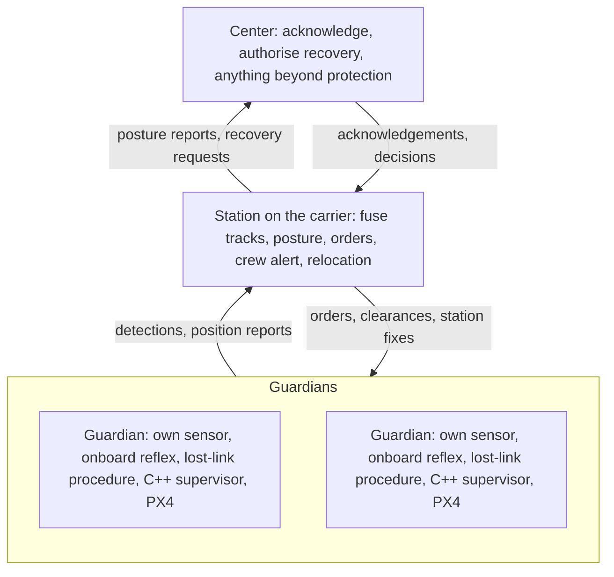

# Guardian drones: design and evaluation

The request: let drones work as guardians that help a station cope with an attack by another drone, or by a missile from far away; think through the scenarios, and design mission control that cooperates with the station, the command center and the drone's own autonomy. This page evaluates that idea, improves it twice, and records what was built and measured. The replay is on [the guardian page](../web/guardian.html); the numbers are in [the simulator results](guardian-results.md).

## 1. The idea, evaluated

**What is strong.** A fleet already flying around a station is a sensor network. Drones at altitude see low flyers that a ground sensor loses behind terrain and clutter, and they can be placed where attacks come from. Giving them a protective role, coordinated with the station and a command center, is the right instinct: the value is in the cooperation, not in any single drone.

**What does not hold up.**

- *Engaging a missile.* A multirotor cruising at 12–15 m/s cannot reach, block or outrun an object moving at hundreds of metres per second; physics settles it before software does. Even a small intruder drone cannot be safely "caught" by another multirotor without specialised equipment and legal authority.
- *Evading a guided threat.* A slower aircraft cannot out-manoeuvre anything that steers toward it. Keeping clear only works against threats flying to a place, not homing on a vehicle.
- *Building intercept or homing guidance.* That is weapons development, and it is out of scope here by design. It would also teach less about mission computers than the problems that remain.

**What the guardian role should be.** Sense and track; warn the station and the crew early; keep the fleet clear of threats; shelter or disperse; fall back safely when links fail; and hand every decision beyond protection to the center. Jamming and GNSS spoofing are the attacks drones meet most often, so they belong in scope.

## 2. First round of improvements: the mission

| Idea as asked | Improved | Why |
|---|---|---|
| Fight the attacker | **Non-kinetic protection:** sense, warn, keep clear, shelter, fall back | Physically credible, legally clear, and it is where mission-computer design matters |
| Missile threat | **Early warning** for fast threats, measured in seconds | For fast threats the only lever is time; the simulator measures how much each design buys |
| Drone and missile only | Add **jamming, GNSS spoofing, loss of the center link, birds and clutter, swarms** | The realistic attack surface; false alarms matter as much as misses |
| "Cooperate with the station, the center or self-control" | **Three layers with explicit authority and time budgets** | Who may decide what, and what happens when the layer above is unreachable |
| Evaluate by watching | **Measure**: warning time, separation, false alarms, detection latency, invariants over many seeded runs | Claims backed by numbers, and regressions caught by tests |

## 3. Second round of improvements: the engineering

1. **Authority by time budget.** Onboard (under a second): keep clear of an imminent conflict, hold and then return when the uplink goes quiet. Station (seconds): fuse tracks, set the posture, order guardians, alert the crew, relocate. Center (tens of seconds): acknowledge, authorise recovery or resumption, anything beyond protection. The station's own actions are *pre-delegated* by the center; with the center unreachable it keeps protecting and may only land guardians after a timeout, never resume the mission.
2. **One decision module, two simulators.** `tools/guardian.py` holds the tracker, threat assessment, posture, keep-clear, onboard fallbacks, the center model, the navigation integrity check and the authority table. The fast simulator and the PX4 nodes import the same code.
3. **Tracks, not detections.** A constant-velocity Kalman filter per track, association in normalised residual, M-of-N confirmation, merging of duplicates, and a plausibility gate on how fast a young track may move.
4. **Classification before alarm.** Guardian cameras label what they see; a track classed as a bird never raises RED, and an unclassified slow track may raise RED only close in. Fast tracks raise RED at once.
5. **Invariants the tests enforce.** A keep-clear move never reduces the range to any threat, and every logged action is taken by a layer allowed to take it.
6. **Cross-checks against spoofing.** The station compares each guardian's reported position with its own sensor's track of it; a slow drag-off passes the drone's own consistency checks but not this one.
7. **Layout is part of the design.** The simulator tests where the posts are, not only what the software does.

## 4. Threats and scenarios

| Scenario | What happens | What it tests |
|---|---|---|
| Low intruder | One drone at 15–20 m/s and 30–50 m altitude, weaving, flies to the station from a random bearing | Detection of low flyers, warning time, keeping clear, relocation |
| Fast inbound | A 250 m/s object cruises at 150–250 m and dives on the station for its last 1.5 km | The limit of what warning can do; confirmation latency; layout |
| Swarm | Five low drones from two sectors, staggered over 30 s | Multiple tracks, multi-threat keep-clear |
| Birds and clutter | Eight slow birds circling 700–1500 m out, with five times the usual clutter | False alarms |
| Jammed picket | An intruder along one picket's sector; a jammer cuts that picket's link | Onboard autonomy under jamming; loss of that picket's sensor data |
| GNSS drag-off | One picket's reported position drifts at up to 3 m/s, ramped in over 30 s | Navigation integrity through cooperation |
| No center link | An intruder while the station cannot reach the center | Delegated authority |
| Combined | Three intruders, a jammed picket, birds and no center link | Everything at once |

## 5. Architecture



| Layer | Time budget | Decides | When the layer above is unreachable |
|---|---|---|---|
| Onboard | Under a second | Keep clear of a conflict predicted inside the reflex horizon; hold when the uplink goes quiet; return to the rally point if it stays quiet | Its own sensor and the pre-briefed lost-link procedure |
| Station | Seconds | GREEN / AMBER / RED; crew alert; keep-clear, hold and disperse orders; relocation; switching a spoofed guardian to station fixes | Keeps protecting; lands guardians under delegation after the center timeout; never resumes the mission alone |
| Center | Tens of seconds | Acknowledgement; recovery or resumption after an event; any response to the threat itself (outside this lab) | Nothing crosses a dead link; decisions are retried when it returns |

## 6. Evaluation method

`tools/guardian_sim.py` is a kinematic simulator. Five guardians (four pickets 900 m out at 80 m, one overwatch above the station at 60 m) fly at up to 12 m/s. The station's ground sensor sees 1200 m, but only 400 m for targets below 50 m; guardian sensors see 800 m in every direction and classify inside 500 m. Links have 0.2 s latency and 2% loss; the center answers after 1.5 s each way plus an 8–20 s operator decision. These are illustrative round numbers chosen to expose trade-offs, not the specification of any real sensor or aircraft.

Four designs run against the same seeded threats: **station only** (no drone sensing), **onboard only** (drones sense and protect themselves, no network), **networked** (drone sensing fused at the station, which gives every order; no onboard autonomy), and **hybrid** (networked plus onboard reflexes, lost-link procedures and the navigation cross-check). Each cell is many seeds; the results page lists medians and percentiles.

## 7. What the evaluation shows

The generated tables are in [the simulator results](guardian-results.md). In summary:

- **Warning comes from the network.** Against a low intruder, the station's own sensor gives almost no warning; fusing guardian sensing gives over a minute, enough for the center to decide before arrival.
- **Safety under jamming comes from onboard autonomy.** A networked design without it leaves a jammed picket in the threat's path; the hybrid design keeps every guardian clear.
- **Spoofing is caught by cooperation.** Only the station's cross-check notices a slow drag-off; without it the picket is dragged hundreds of metres.
- **False alarms need classification, not just tracking.** Linear prediction on a circling bird points at the station now and then; camera labels and the persistence rule removed every false RED in the drone-sensing designs.
- **Physics limits what software can do.** No design saves a drone hovering over the impact point of a 250 m/s object with a few seconds of warning. Moving that drone 250 m off the station fixes most of it; moving the pickets out buys warning against slow threats but little against fast ones.

## 8. Lessons the simulator taught

Each of these was found in a failing run, traced, and fixed in the shared module:

| Found | Symptom | Fix |
|---|---|---|
| Fixed-gain filter with a two-point velocity start | An 18 m/s intruder read as 10–60 m/s; heading flipped; RED came seconds before arrival | Constant-velocity Kalman filter weighted by each sensor's noise |
| Straight-line prediction against a weaving intruder | At long range a 20° weave misses the station by hundreds of metres | "Inbound" also means heading within 25° of the station |
| Friendly association by nearest report | A threat passing close to a guardian was absorbed as that guardian and dropped from tracking; the same mistake raised a false spoofing alarm | Each friendly claims only its nearest return; every other return is tracked |
| Clutter chains | Random points lined up into "tracks" at hundreds of metres per second and raised false REDs | A young track may only take detections reachable at a plausible speed; RED needs support beyond confirmation |
| Keep-clear chattering | A guardian that moved far enough to clear the prediction was told to hold, stopped halfway and was back in conflict | An episode latch: keep clear until the conflict has passed, re-planning but never dropping to hold |
| Lost-link return at ground level | A jammed guardian flew home at the station's height, straight through the intruders' altitude band | The rally point keeps cruise altitude |
| Too few escape options | Two crossing intruders squeezed a guardian | Half-length moves and a climb option under a ceiling |
| Overwatch above the protected point | Unsavable against a fast inbound object | Offset the overwatch (layout experiment) |

## 9. The same logic on real PX4

The `guardian_intruder` flight scenario runs the decision module on three real PX4 instances in Gazebo. Guardians launch from the carrier and hold watch posts. A scripted, visual-only intruder flies to where the carrier is parked. The first guardian reports it over the network; the second is jammed as the intruder arrives and keeps clear on its own; the third is far away. The station raises RED, drives the carrier out of the path, and orders keep-clear moves; after the intruder has gone, the center authorises recovery and the guardians land back on the carrier. The environment (intruder, sensors, jamming) and the center are simulated; the guardians' adapters, supervisors and PX4 are the real flight stack. [The SITL guide](sitl-guide.md) lists the topics and acceptance checks.

## 10. Limits

- The simulators model kinematics, not aerodynamics, radar physics, camera performance or radio propagation. Real sensor ranges, clutter and classification accuracy vary widely.
- Threats fly to fixed points. A threat that steers toward a guardian cannot be escaped by keeping clear; the design's answer is warning and sheltering, not evasion.
- Identification of friendlies relies on reported positions; real systems add transponders, authenticated datalinks and pre-briefed corridors.
- The station and center are software stand-ins on one host; operator workload, rules of engagement and airspace procedures are out of scope.
- Nothing here responds to a threat. That decision, and the systems that carry it out, sit with the center and with authorised operators.

## Reproduce

```bash
python3 tools/guardian_sim.py --seeds 40 --workers 8 --output artifacts/guardian
python3 -m unittest tests.test_guardian
bash scripts/run_sitl.sh --scenario guardian_intruder --video --output ~/work/mission-computer-lab/retests/guardian-001
```
