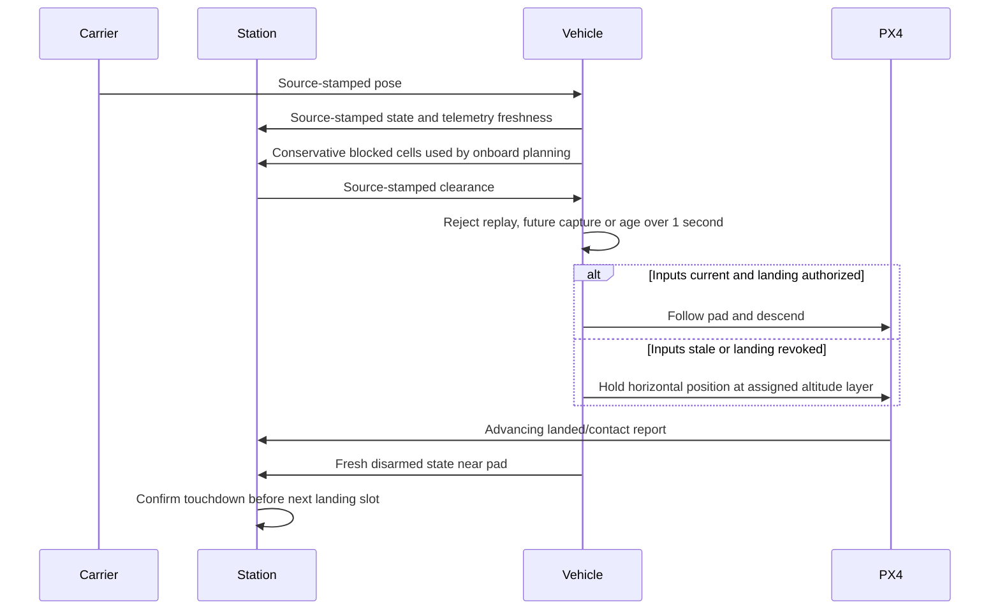
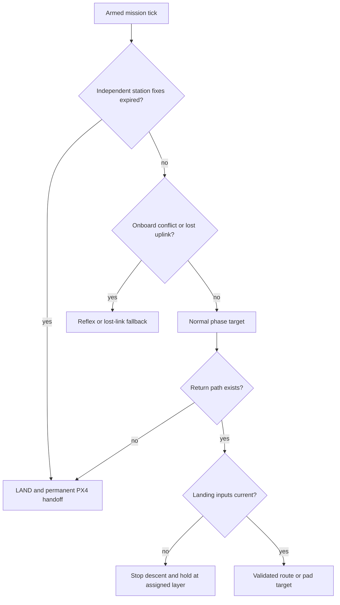
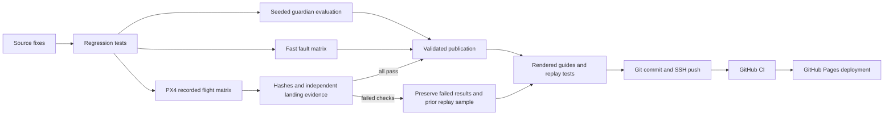

# Review fixes and how to reproduce them

This change addresses the eight findings reproduced against commit `dac9f1b`. It keeps emergency checks active across mission phases, validates complete avoidance paths, rejects incomplete evidence and recovers a failed publication. The implementation and test record are linked from [the review history](review-report.md) and [the current validation record](validation.md).

## What changed

| Finding | Implemented behavior | Regression coverage |
|---|---|---|
| R1: navigation fallback only ran on watch | Station-fix expiry, lost uplink and onboard conflict decisions run before every armed transit/approach phase. A handoff stops the current tick before publishing another offboard command | Every airborne phase with an expired fix; uplink loss during transit/landing; a return-phase conflict; immediate handoff |
| R2: only the destination avoided other guardians | The whole horizontal flight segment must clear each friendly position and stale-position uncertainty circle | Crossing, tangent and clear segments; uncertainty circle crossing |
| R3: no route became a direct flight | A failed return plan requests LAND and permanently hands control to PX4 | A complete obstacle barrier cannot produce a direct corridor target |
| R4: carrier/clearances never expired | Source-stamped carrier pose, clearance and state streams reject old, future and repeated captures. Launch/landing needs fresh inputs. Lost landing inputs or revoked clearance stop descent and hold horizontally at the vehicle's altitude layer | Each input stopped independently; replay/future/nonfinite timestamps; stale vehicle state; explicit landing revocation |
| R5: disarm was treated as touchdown | Station sequencing requires a fresh, advancing PX4 landed/contact report after flight, a disarmed vehicle near its pad, and fresh carrier/state data. The runner independently checks airborne, landed/contact and disarm observations | Missing, stale, replayed or non-contact land reports; disarm above deck; valid ordered evidence |
| R6: incomplete scenario entities could pass | The publisher requires exactly one of each configured vehicle and exactly the configured threat set | Duplicated/missing/extra identities, empty truth and full publisher rejection without replacing the old sample |
| R7: failed promotion removed the sample path | Promotion restores the old sample on failure. A later invocation recovers an interrupted retirement. Cleanup failures preserve the installed sample | Injected second-rename failure, retry, interruption recovery and cleanup failure |
| R8: cached moves ignored new obstacles | Retained keep-clear orders and received station avoidance targets must pass the current free-space check | Newly blocked cached route; still-valid cached route; invalid station target |

The new test cases are in `integration/test_review_regressions.py`, `tests/test_publication.py`, `tests/test_guardian.py` and the existing ROS contract suites. Tests use actual decision and validation functions with controlled inputs; they do not launch physical hardware.

Flight retests exposed three additional edge cases. A deck altitude estimate below the nominal deck height could leave the vehicle hovering with too little downward command; descent now continues toward a nonnegative target while PX4 owns contact detection and disarm. Also, rejecting a blocked station target when the vehicle had no local tracks produced an infinite predicted-clearance metric, which strict JSON logging correctly rejected. Orders now omit the unavailable metric, and regression tests require strict JSON serialization for both a blocked cached target and a blocked station target with no tracks.

Finally, the station's continuous obstacle geometry could admit a route that the vehicle's more conservative LiDAR grid rejected. Guardian state now includes its blocked cells, and station orders must clear both the known geometry and that reported grid. The vehicle still rechecks against its current map when the order arrives. The station regression adds a newly reported blocked cell on its previous route and requires the replacement route to avoid it. This retains the obstacle gate instead of allowing a rejected route to execute.

## Runtime contracts

Station and carrier streams use the ROS clock. In SITL this is Gazebo simulation time, so recording slowdown does not make a healthy stream stale. The allowed age is one simulated second. Capture times must advance, must not be in the future and must not already be expired at receipt. Replayed messages cannot extend validity. The adapter also reports whether its underlying PX4 pose/status telemetry is fresh, so a live report timer cannot keep old vehicle data healthy.

The fleet clearance envelope is now:

```json
{"t": 42.1, "clearance": {"px4_0": {"launch": true, "land": false}}}
```

Guardian uplinks already contain an envelope and now pass the same freshness gate. Station orders continue to carry their existing authority. The station independently subscribes to each PX4 instance's `vehicle_land_detected` topic; an advancing report is valid for two simulated seconds. Ground contact and landed must both be true. Initial landed reports before takeoff cannot prove a later touchdown.



### Guardian emergency priority

Emergency behavior is evaluated before normal armed transit and approach sequencing. Expired independent fixes take priority over ordinary maneuver commands when GNSS is already untrusted. Routine station recovery orders do not restart the return route on every tick. Onboard reflexes and lost-link procedures can override the route; watch continues to use the same shared guardian decision code as the fast simulator.



### Publication recovery

The publisher validates the complete scenario matrix and exact entity sets before creating a replacement. It builds the replacement in a sibling directory. On promotion failure, the previous directory is restored. If the process stops between retirement and promotion, the next invocation restores it before validating new input.

This is rollback and restart recovery, not a claim of a filesystem transaction across the generated report and Markdown page. During the two renames a reader can still briefly observe the sample path missing. Hosted Pages deployments use the completed repository snapshot after CI, rather than serving these local directories during publication.

## Reproduce the checks in WSL

Use the existing setup from [the complete reproduction guide](complete-reproduction-guide.md). Do not run two PX4 matrices at once: their ports and simulator resources overlap.

```bash
cd /mnt/c/Users/n/source/repos/mission-computer-lab
export SITL_WORKSPACE="$HOME/work/mission-computer-lab"
export PYTHON="$SITL_WORKSPACE/venv/bin/python"

# Recompute evidence that is bound to the guardian decision source hash.
"$PYTHON" tools/guardian_sim.py --seeds 40 --workers 8 --output artifacts/guardian

# Build, unit-test and run the accelerated fault matrix.
PYTHON="$PYTHON" bash scripts/run_all.sh
"$PYTHON" -O -m unittest discover -s tests -p 'test_*.py'
bash scripts/test_integration.sh
```

Current suite counts and the completed flight result are recorded in [validation](validation.md). Every command must exit zero. `python -O` proves the validation gates do not depend on removable assertions.

Run the complete flight matrix into a new directory. A nonempty output directory is rejected to preserve previous evidence:

```bash
RETEST="$SITL_WORKSPACE/retests/review-fixes-$(date +%Y%m%d-%H%M%S)"
bash scripts/run_sitl.sh --all --video --output "$RETEST"
```

Expected: thirteen PASS results and exit zero. The fleet and eight guardian scenarios now include one independent `landed_confirmed` check per vehicle. Inspect failed checks, observer logs, station logs and mission logs before retrying. Keep the failed directory intact and choose a new output directory for a retry.

For a diagnostic run that completes every case even after a failure, add `--keep-going`. It preserves each failed check and still exits nonzero; it does not relax publication requirements. The fast-inbound retest exposed a remaining timing limit: with the strengthened obstacle checks, all vehicles recovered and landed safely, but one run moved only 0.38 m farther from the impact point before arrival, below the required 0.50 m increase. See the current validation record before interpreting the older passing replay as evidence for the latest source.

Check the result and the runtime source fingerprints:

```bash
"$PYTHON" - "$RETEST" <<'PY'
import hashlib, json, pathlib, sys
run=pathlib.Path(sys.argv[1])
results=json.loads((run/'results.json').read_text())
provenance=json.loads((run/'provenance.json').read_text())
if len(results)!=13 or not all(r['passed'] and all(v is True for v in r['checks'].values()) for r in results):
    raise SystemExit('Incomplete or failed flight matrix')
if provenance['inputs_unchanged'] is not True:
    raise SystemExit('Runtime inputs changed during flight')
for name,want in provenance['environment']['input_sha256'].items():
    if hashlib.sha256(pathlib.Path(name).read_bytes()).hexdigest()!=want:
        raise SystemExit('Source changed after flight: '+name)
print('Complete passing matrix and matching current inputs')
PY
```

Publish only after those checks pass:

```bash
"$PYTHON" tools/publish_sample.py
"$PYTHON" tools/publish_sitl.py --input "$RETEST"
npm run docs
node tests/test_diagrams.mjs
node tests/test_dashboard.mjs
node tests/test_sitl_dashboard.mjs
node tests/test_fleet_dashboard.mjs
node tests/test_guardian_dashboard.mjs
node tests/test_theme.mjs
"$PYTHON" tools/check_docs.py
git diff --check
```

If Node is installed only on Windows, run the `npm` and `node` commands from PowerShell in the same checkout. The local HTML pages load their bundled Mermaid and replay dependencies without a CDN.



## Deployment checks

After committing the fixes, regenerated evidence and rendered guides together, push `main` over Git SSH. The existing Pages workflow automatically deploys a successful push-triggered `simulation-evidence` run. Verify that both the CI run and the Pages run reference the pushed commit, then open the public replay and this guide.

From the checkout, inspect the changes before staging them. For this fix, the checkout was initially clean, so every resulting source, test, guide and evidence change belongs to the same update:

```bash
git status --short
git diff --check
git add -A
git commit -m "Fix mission safety boundaries and evidence publication"
git push origin main
git rev-parse HEAD
git ls-remote --heads origin main
```

The two hashes must agree. Do not force-push if another update has reached the remote. With an authenticated GitHub CLI, inspect the runs for the pushed commit:

```bash
COMMIT=$(git rev-parse HEAD)
gh run list --commit "$COMMIT" --workflow ci.yml --limit 5
# Copy the run ID shown above into the next command.
gh run watch CI_RUN_ID --exit-status

# The Pages run appears after successful push-triggered CI.
gh run list --commit "$COMMIT" --workflow pages.yml --limit 5
gh run watch PAGES_RUN_ID --exit-status
curl --fail --location https://buicongnguyen.github.io/mission-computer-lab/docs/review-fixes.html
```

Replace `CI_RUN_ID` and `PAGES_RUN_ID` with the numeric IDs from the corresponding listings. If a run fails, use `gh run view RUN_ID --log-failed` to inspect its failed step. A successful HTTP response alone does not identify the deployed revision: also check the successful Pages run's commit against `COMMIT` and confirm the new guide's content is present.

The hosted workflow exercises the portable unit, simulation and page checks. ROS and full PX4/Gazebo flights are performed locally in WSL and preserved through runtime provenance. Passing hosted CI is not evidence that GitHub ran the entire flight matrix.

The project remains a software simulation: procedural payload sensors, CPU ONNX, PX4 firmware in Gazebo and illustrative guardian decisions. These fixes do not establish physical flight qualification or Qualcomm hardware/NPU behavior.
