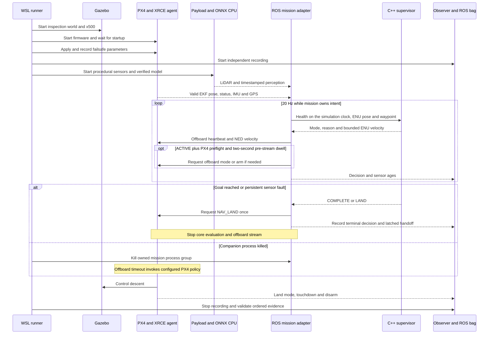

# Run the real PX4 / ROS 2 / Gazebo pipeline in WSL

For the full setup history and step-by-step retest procedure, start with [the complete reproduction guide](complete-reproduction-guide.md). It separates rerunning a prepared environment from rebuilding a fresh one and includes expected output, log-reading commands and every resolved integration issue.

This is the project's integration track. PX4 runs its actual flight firmware as a Linux process; Gazebo Harmonic simulates the x500's dynamics and flight sensors; ROS 2 Humble carries typed payload and control messages. The C++ supervisor supplies mission intent. The simpler, accelerated simulator remains available for fast policy tests.

This setup uses WSL Ubuntu 22.04, CPU ONNX inference and a synthetic payload camera/LiDAR. It does not emulate a Qualcomm SoC, its NPU, secure boot ROM or hardware interfaces. The flight estimator is PX4 EKF2. Losing GPS demonstrates conservative failure handling; it does not demonstrate VIO or successful GPS-denied navigation.

## 1. Prepare the environment

In Windows PowerShell:

```powershell
wsl --list --verbose
wsl -d Ubuntu-22.04
```

Then in Ubuntu:

```bash
cd /mnt/c/src/mission-computer-lab   # your checkout
bash scripts/bootstrap_wsl.sh
bash scripts/run_all.sh
sudo bash scripts/install_sitl_system.sh
bash scripts/build_sitl.sh
```

Substitute your checkout path. If these dependencies are already installed and built, proceed to section 2. The system installer adds the official ROS and OSRF apt repositories and installs ROS Humble, Gazebo Harmonic, the ROS/Gazebo bridge, colcon, OpenCV and build dependencies. It uses `apt-get --no-remove` so a dependency conflict stops instead of silently removing existing packages.

Upstream sources, compiled libraries, the ROS workspace and a Python environment live under `~/work/mission-computer-lab` on WSL's Linux filesystem. This avoids putting the very large PX4 tree and build output on the Windows mount. The small project source remains in this repository. Reserve several GB of free storage and allow substantial first-build time. The development machine had approximately 15 GB of memory available to WSL; the build uses three compiler jobs.

The build selects PX4 v1.16.0 and XRCE Agent v2.4.3. PX4 message definitions use the matching `release/1.16` family. Exact tested commits appear in the execution evidence. Do not mix a different firmware message layout with an arbitrary `px4_msgs` branch. The build script creates two ROS packages: upstream `px4_msgs` and this project's `mission_interfaces`.

## 2. Run one mission before running faults

```bash
bash scripts/run_sitl.sh --scenario nominal --output artifacts/my-sitl-nominal
```

Use a fresh, empty output directory for each attempt. The runner refuses nonempty output directories, including old summaries. For long recordings prefer WSL's Linux filesystem, for example `--output ~/work/mission-computer-lab/retests/flight-001`; a `/mnt/c` live-log run encountered an OS I/O failure during review. It starts only its own child processes and cleans them up at the end. Run one runner at a time: single-drone scenarios use PX4 instance 0, XRCE port 8888 and a local MAVLink GCS port 14550; the fleet scenario runs instances 0–2 against the same agent, with GCS heartbeats on UDP 18570–18572. `ROS_DOMAIN_ID=42` separates this lab from typical ROS workspaces; it is not authentication or network isolation. The tested DDS setup uses normal participant discovery because `ROS_LOCALHOST_ONLY=1` prevented discovery of the agent's PX4-created participant. Use an isolated development network and do not attach flight hardware to this simulation setup.

The launcher starts the Gazebo server without a window (it still renders offscreen through EGL, so the world's cameras can record), bridges Gazebo's `/clock` into ROS, attaches PX4 to `x500_0` in the `inspection` world, waits for the startup script, applies and records the final simulation parameters, then starts the payload, perception, mission and observation processes. A separate minimal MAVLink GCS process sends heartbeats and receives PX4 heartbeats. It does not send flight commands. ROS 2/DDS carries offboard commands.

Expected mission sequence:

1. Gazebo creates the floor, three cylindrical obstacles, the launch pad and goal markers, an overview camera and the x500.
2. PX4 starts flight sensors and EKF2; the agent exposes firmware telemetry to ROS.
3. A user-space model verification gate checks the ONNX artifact; ONNX Runtime opens a CPU session.
4. The payload publishes RGB images and planar laser scans at 10 Hz. The perception node publishes typed inference results retaining the image capture timestamp.
5. The mission node obtains a valid local estimate, computes an inflated occupancy map and A* path, then gives the C++ supervisor time-stamped samples at 20 Hz.
6. Offboard proof-of-life and velocity setpoints stream before the adapter requests offboard mode and arm. PX4's own checks decide whether to accept them.
7. The vehicle climbs to 3 m, follows the route to the inspection goal, receives a land command and disarms after landing.
8. The independent observer and runner evaluate recorded telemetry. A successful command request alone does not count as successful flight.

## 3. Watch the vehicles fly

Three views show the same flights, each with a different purpose.

| View | How | What it is |
|---|---|---|
| Recorded Gazebo video | Add `--video` to any run. The world's overview camera writes `flight.mp4`; the fleet run also records `deck.mp4` from a camera on the carrier | Gazebo's own renderer (ogre2, offscreen EGL), H.264 stamped on simulation time, so it plays at true flight speed. The published flights include these files, and the [flight replay](../web/sitl.html) and [fleet page](../web/fleet.html) play them |
| Live Gazebo window | Add `--gui`. Under WSLg a Gazebo client window opens and attaches to the running server | For demonstrations. It is not recorded evidence, and closing it does not stop the run |
| Interactive 3D replay | The **3D** view on both replay pages | three.js redraws the recorded PX4 estimates, plans, obstacles and carrier. Drag to orbit, scroll to zoom. It works offline, including from a clone opened as local files |

```bash
bash scripts/run_sitl.sh --scenario nominal --video --gui --output ~/work/mission-computer-lab/retests/watch-001
```

These cameras film the world for people. The payload camera that feeds ONNX is still the procedural one described in section 6.

Recording is not free. Rendering and encoding happen inside the simulation loop; on the development machine the real-time factor fell from 1.0 to 0.64 with one recording camera and 0.41 with two, whatever the resolution. Nothing in the pipeline depends on running at real-time speed: PX4 already runs on Gazebo's clock, and every ROS adapter runs with `use_sim_time`, so freshness deadlines stretch with the simulation (section 7). The runner's wall-clock timeout is multiplied by 2.5 when `--video` is set.

## 4. Fly a fleet from a moving carrier

```bash
bash scripts/run_sitl.sh --scenario fleet_carrier --video --output ~/work/mission-computer-lab/retests/fleet-001
```

The `fleet` world adds a carrier vehicle: a 3.2 × 1.6 m deck, 0.6 m high, with three landing pads 1.1 m apart, driven along an obstacle-free road by Gazebo's velocity controller. Three PX4 instances (`px4 -i 0..2`, `MAV_SYS_ID` 1–3, DDS namespaces `px4_0` to `px4_2`) start on those pads. Each vehicle has its own complete stack (payload, verified perception, observer, and a mission adapter with its own C++ supervisor), so one vehicle's fault handling never depends on another's. Commands carry each vehicle's own system ID; PX4 ignores commands addressed to another vehicle.

| Vehicle | Pad offset along the deck | Inspection goal | Altitude layer |
|---|---|---|---|
| `px4_0` | −1.1 m | (9, 9) | 3 m |
| `px4_1` | 0 | (10, 3) | 4 m |
| `px4_2` | +1.1 m | (−1, 10) | 5 m |

The ground station (`integration/fleet_station_node.py`) rides on the carrier. It never commands a vehicle; it grants clearances and drives the carrier.

1. **Launch** one vehicle at a time, each after the previous one is above 2 m and at least 4 s after the previous clearance. An adapter requests arming and offboard only while it holds a launch clearance, in addition to its supervisor's and PX4's own preflight gates.
2. **Outbound and inspect** along the A* route, replanned from scans, at the vehicle's own altitude layer, then hover 3 s over the goal.
3. **Return** by A* to the road corridor south of every obstacle.
4. **Drive**: once every vehicle has flown and the first one heads home, the carrier drives east at 0.3 m/s, so recoveries meet a moving deck.
5. **Rendezvous**: each vehicle holds its altitude layer over its own pad. To follow a moving pad without lag it aims one second ahead: the supervisor commands velocity proportional to position error at 1/s, so aiming at `pad + carrier velocity × 1 s` makes the commanded velocity equal the carrier's once the vehicle is over its pad.
6. **Land** one at a time: the station clears the lowest layer among the vehicles holding overhead. The vehicle descends at up to about 0.6 m/s while tracking its pad; if it drifts more than 0.5 m off the pad before reaching the deck, it goes around to its layer and waits again. PX4's land detector disarms it on the deck.
7. The carrier stops when every vehicle is down, or at the end of the road, and stays parked.

| Acceptance check | Criterion |
|---|---|
| Per vehicle: offboard, takeoff, goal | Armed OFFBOARD observed; climb above 2 m; inspection started within 0.6 m of its goal |
| Per vehicle: returned and landed on its pad | Rendezvous and descent phases recorded; touchdown within 0.4 m of its own pad and within 0.35 m of deck height |
| Per vehicle: moving deck | Carrier speed above 0.15 m/s at that vehicle's touchdown |
| Per vehicle: safety | Disarmed at the end; no PX4 failsafe; estimated obstacle clearance above 0.5 m |
| Fleet separation | Closest approach between airborne vehicles above 1.0 m, from time-aligned observer traces at 5 Hz |
| Landings sequenced | Three land clearances, each granted after the previous vehicle's touchdown |
| Carrier moved; ROS bag | Carrier travelled more than 3 m; the bag holds every vehicle's decision topic and the clearance topic |

**Observed limitation: PX4 treats a moving deck as GNSS drift.** After each landing, PX4 logged `Preflight: GPS Horizontal Pos Drift too high` and the drone's position estimate stopped following the carrier. In PX4 v1.16, EKF2 runs its GNSS drift and speed checks only while the vehicle is on the ground and at rest (`src/modules/ekf2/EKF/aid_sources/gnss/gps_checks.cpp`). A drone riding a deck at a steady 0.27 m/s feels no acceleration, so it counts as at rest, while its GNSS position moves faster than `EKF2_REQ_HDRIFT` (default 0.1 m/s). EKF2 then skips those GNSS samples, the estimate stays where the drone landed, and the failing preflight check would block re-arming while the carrier moves (re-arming was not attempted in this run). The acceptance checks are not affected: each drone's estimate tracked its pad through touchdown (2–10 cm at first deck contact), pad error is recorded when PX4 declares the landing and disarms, and separation and clearance use only airborne samples. The fleet replay draws a landed drone on its pad, and the deck camera shows where the drones physically are. Launching again from a moving vehicle would need a deliberate design: a moving-base or relative position source, or deck-specific GNSS check settings validated for the aircraft.

Pad error compares the vehicle's PX4 estimate, converted to world coordinates, with the carrier pose from Gazebo odometry; separation and clearance also use PX4 estimates. These are simulation checks, not certified collision guarantees. The station and the vehicles share one host and one DDS domain. Radio links and their latency or loss, relative positioning on the pad (RTK or vision), deck motion, wind and a real carrier's dynamics are not modelled, and the carrier's road is obstacle-free by design.

## 5. Guardians against an intruder

```bash
bash scripts/run_sitl.sh --scenario guardian_intruder --video --output ~/work/mission-computer-lab/retests/guardian-001
```

The guardian scenario runs the decision logic of [the guardian design](guardian.md) (`tools/guardian.py`) on three real PX4 instances. The `guardian` world is the fleet world plus a scripted, visual-only intruder (no collision, no gravity), post markers and a translucent jamming zone. Its cameras are an overview and a low close-up of the intruder's final approach.

| Guardian | Watch post | Altitude | Role in the scenario |
|---|---|---|---|
| `px4_0` | (1, 2) | 4 m | In the intruder's path and inside the jamming zone: it must keep clear on its own |
| `px4_1` | (0, 12) | 5 m | First contact: its detections reach the station over the network |
| `px4_2` | (12, 8) | 3 m | Far from the path: it holds |

1. The guardians launch one at a time and fly to their posts; the adapter's phase becomes `watch`.
2. Five seconds after all three are on watch, the environment node starts the intruder at (−3.4, 23) flying at 1.2 m/s and 4 m to where the carrier is parked, and switches the jammer on.
3. Each guardian's simulated sensor (8 m range, camera label inside 5 m) feeds its own onboard tracker directly; the same detections reach the station only over the link, which the environment drops while a guardian is inside the jamming zone. The station has its own 6 m sensor.
4. The station fuses the tracks, raises AMBER and then RED, alerts the crew, drives the carrier east out of the path (a delegated action), and orders keep-clear moves. The order to `px4_1` arrives; the orders to `px4_0` do not.
5. `px4_0` notices its silent uplink and holds on its own authority; when its own sensor predicts a conflict inside its reflex horizon, it keeps clear on its own.
6. After the intruder has gone and the posture is back to GREEN, the station asks the center; the center node answers after its link delay and operator decision time, and the station relays its `recover` decision. The guardians return and land on the carrier one at a time.

| Station, environment and center topics | Type | Contract |
|---|---|---|
| `/station/uplink` → environment → `/px4_N/guardian/uplink` | JSON in `std_msgs/String`, 10 Hz | Launch and land clearances, each guardian's order, the posture; dropped while that guardian is jammed |
| `/px4_N/guardian/state` → environment → `/fleet/px4_N/state` | JSON, 5 Hz | Phase, world position, protective action and the layer that decided it, uplink age; dropped while jammed |
| `/px4_N/guardian/detections` | JSON, 5 Hz | The guardian's own sensor; never jammed |
| `/station/detections` | JSON | Guardian detections relayed over the link, plus the station's own sensor |
| `/center/report`, `/center/decision` | JSON | Posture changes and recovery requests; acknowledgements and decisions after the center's delays |
| `/model/intruder/odometry`, `/model/intruder/cmd_vel` | `nav_msgs/Odometry`, `geometry_msgs/Twist` | Intruder truth for the sensors and the checks; its scripted motion |

| Acceptance check | Criterion |
|---|---|
| Per vehicle | Armed OFFBOARD; climb; on watch within 0.6 m of its post; returned, landed on its pad, disarmed; no failsafe; obstacle clearance |
| `intruder_flew`, `threat_confirmed` | The intruder crossed the carrier's parking spot; the station confirmed a track |
| `red_before_arrival` | RED came before the intruder reached the carrier's protected radius (3 m) or, if it never did, its closest approach; the warning is reported in simulated seconds |
| `carrier_relocated_clear` | The station relocated the carrier, and the intruder never came within 3 m of it |
| `guardians_kept_clear` | Every guardian stayed at least 1.5 m from the intruder, from the observers' traces and the intruder's odometry |
| `jammed_guardian_acted_alone` | `px4_0` kept clear on the onboard layer with its uplink silent, and the environment recorded dropped messages |
| `station_ordered_keep_clear` | A guardian that was not jammed executed a keep-clear order from the station |
| `never_closed_on_threat` | Every keep-clear decision, by station or vehicle, moved away from every threat position it knew |
| `authority_respected` | Every logged action was taken by a layer allowed to take it; relayed recovery carries the center's authority |
| `recovery_by_center` | Recovery followed the center's decision |
| Fleet | Separation between airborne guardians above 1 m; landings one at a time; ROS bag recorded |

The intruder, the sensors and the jamming are simulated stand-ins; the guardians' adapters, supervisors and PX4 are the real flight stack. Nothing in the scenario responds to the intruder.

## 6. Exercise failures

The sequence separates mission intent from PX4's ownership of the actual vehicle. Logs and ROS bags observe both sides.



```bash
bash scripts/run_sitl.sh --all --video --output ~/work/mission-computer-lab/retests/matrix-001
```

`--all` runs the four single-drone scenarios below, then the fleet scenario from section 4 and the guardian scenario from section 5. The matrix stops at the first failed scenario so its logs can be investigated. Alternatively select `camera_dropout`, `companion_crash`, `gps_loss`, `fleet_carrier` or `guardian_intruder` with `--scenario`.

| Scenario | Injection boundary | Evidence to inspect |
|---|---|---|
| Nominal | No deliberate fault | Arm acknowledgment, offboard state, climb, route completion, PX4 land state and disarm |
| Camera dropout | Payload stops publishing images for 0.8 seconds, signalled 3 s after the vehicle climbs above 2 m | Perception timestamp becomes stale; C++ emits HOLD; fresh frames plus recovery dwell allow ACTIVE again |
| Companion crash | Runner sends SIGKILL to the mission process group, including C++ | Independent observer survives; PX4 detects lost offboard proof-of-life and applies its own land policy |
| GPS loss | Set the Gazebo bridge's `SIM_GPS_USED=0` through PX4 | Observed invalid GPS fix, rejection of fresh-but-invalid packets, HOLD then LAND, land and disarm |

The camera and LiDAR are **procedural ROS payload sensors**, not rendered Gazebo camera/lidar plugins. The camera contains a moving bright synthetic shape; the ONNX graph segments brightness. This deliberately small model tests artifact, tensor, timing and communication contracts. It has no trained class semantics, and its bounding box does not steer toward an aerial target. The inspection route is independent of object identity.

## 7. Follow the interfaces

| Producer → consumer | Interface | Contract |
|---|---|---|
| Gazebo → PX4 | PX4 Gazebo bridge | Physics, IMU, magnetometer, pressure and GNSS feed actual firmware |
| PX4 → ROS | uXRCE-DDS agent, UDP 8888 | Matching message schemas; output subscriptions use best-effort sensor QoS |
| Payload → perception | `/mission/camera/image`, `sensor_msgs/Image` | RGB8, 64×48, 192-byte row stride, capture timestamp |
| Payload → planner | `/mission/lidar/scan`, `sensor_msgs/LaserScan` | 72 planar world-aligned rays, 14 m range, 10 Hz |
| Perception → mission | `/mission/perception`, `mission_interfaces/Perception` | Sequence, source stamp, bounding box, inference duration, model hash and execution provider |
| Mission ↔ C++ | Line-oriented stdin/stdout | Sequence validation, finite values and bounded intent; subprocess timeout is fatal |
| Mission → PX4 | `OffboardControlMode`, `TrajectorySetpoint`, `VehicleCommand` | Velocity control at 20 Hz, unused setpoint fields NaN, explicit arm/mode/land requests |
| Mission → observer | `/mission/decision`, `mission_interfaces/Decision` | Mode/reason, ENU pose/target/velocity, sensor ages and waypoint index |
| Gazebo → every ROS adapter | `/clock` through `ros_gz_bridge` | Simulation time; adapters run with `use_sim_time` |
| Fleet namespaces | `/px4_N/fmu/...` and `/px4_N/mission/...` | The same contracts per vehicle; `MAV_SYS_ID` is N + 1 and every command targets it |
| Carrier → station and vehicles | `/model/carrier/odometry`, `nav_msgs/Odometry`, 20 Hz | World pose; twist in the carrier's body frame, rotated to ENU by each consumer |
| Station → carrier | `/model/carrier/cmd_vel`, `geometry_msgs/Twist`, 10 Hz | Forward speed only; Gazebo's velocity controller drives the model |
| Vehicle ↔ station | `/fleet/px4_N/state` at 5 Hz; `/fleet/clearance` at 10 Hz (JSON in `std_msgs/String`) | Phase, world position, armed, layer and pad error; launch and land grants for each vehicle |

PX4 local position is NED: north, east, down. Application coordinates are ENU: east, north, up. Position is referred to the initial valid local estimate; velocity converts as `[north,east,down] = [enu_y,enu_x,-enu_z]`. The payload LiDAR is explicitly world-aligned; a physical body-frame scanner would need calibrated transforms, orientation and motion compensation. Some PX4 topics carry a `_v1` suffix; `px4_topic()` derives this from the message's `MESSAGE_VERSION` constant.

Do not compare PX4 boot microseconds directly with ROS wall-clock seconds. In SITL every adapter runs on one clock, Gazebo's simulation time (`use_sim_time`, fed by the `/clock` bridge), the same clock PX4 runs on. This matters: with wall-clock deadlines, recording video slowed the simulation enough that healthy telemetry looked stale, and the first fleet run's vehicles escalated to LAND before take-off. Without `use_sim_time`, as on hardware, the adapter uses the monotonic clock instead. Either way, the adapter refreshes a receipt time only when a firmware source timestamp advances. Image and scan source stamps must advance and cannot be in the future; their capture age is converted to a fixed timestamp on the adapter's clock on receipt. Neither clock follows ROS wall-clock jumps. Repeating an old PX4 sample cannot refresh health. A new GPS packet also requires a 3-D fix and valid NED velocity to refresh navigation health. High-rate position receipt monitors the link; approximately 2 Hz vehicle status has a separate 1.5-second freshness bound. This single-host experiment does not validate a distributed clock synchronization design.

The occupancy map starts from the first scan and grows with every later scan; the mission node replans if the remaining route closes and lands if no route remains. Payload scan geometry is generated from the same idealized obstacle configuration used by the world. Sensor occlusion, reflective materials, rolling shutter, calibration error and moving-obstacle avoidance are outside this experiment. EKF position telemetry is an estimate, not Gazebo ground truth; a clearance calculation from that estimate is not a certified collision guarantee.

## 8. Inspect the evidence

The output root also contains `provenance.json`: versions and source/binary hashes captured before flight, plus a post-run unchanged-input check. Publication uses this saved record. Each scenario directory contains:

- `result.json`: acceptance checks, status transitions, command acknowledgments, message counts, position trace and decisions.
- `observer.jsonl`: independent firmware and ROS observations, including after a mission crash.
- `mission.jsonl`: A* plan, supervisor transitions, selected decisions and outgoing commands.
- `perception.jsonl`: model/provider evidence and inference measurements.
- `parameters.log`: final configured failsafe parameters read back from PX4.
- `rosbag/`: recorded typed decision, perception and LiDAR topics.
- Per-process `.log` files, plus `gps-injection.log` in the GPS-loss case.
- `flight.mp4` when recorded with `--video`.

The `fleet_carrier` folder holds one `result.json` for the whole fleet, `station.jsonl` (clearances, carrier samples, touchdowns), per-vehicle `mission_px4_N.jsonl`, `observer_px4_N.jsonl`, `perception_px4_N.jsonl` and `px4_N.log`, and `flight.mp4` plus `deck.mp4` when recorded. The `guardian_intruder` folder has the same per-vehicle files plus `world.jsonl` (intruder truth, jamming and link events, dropped messages), `center.jsonl`, and `flight.mp4` plus `close.mp4`.

Acceptance requires an ordered armed-offboard → airborne → armed-land-mode → touchdown → disarm sequence, a valid final vertical estimate near the ground, and recorded messages on all three selected bag topics. GPS-loss may invalidate horizontal localization after the recorded injection; pre-injection validity and final vertical validity remain required. Clearance is computed only while the position estimate is valid. Arm and land ACKs alone cannot establish those outcomes.

PX4 ULog files remain under the corresponding `~/work/mission-computer-lab/runs/` directory. Large bags, ULogs and upstream builds are not committed. The published sample contains compact evidence and a replay. A replay is a recorded run, not a live flight console.

To inspect a bag in a new WSL terminal:

```bash
source /opt/ros/humble/setup.bash
source ~/work/mission-computer-lab/ros_ws/install/setup.bash
ros2 bag info artifacts/my-sitl-nominal/nominal/rosbag
```

Do not replay command topics into a running controller. This recorder selects application evidence topics only; it does not record command topics for automatic playback.

## 9. Understand the failsafe ownership

The C++ supervisor reacts to stale data with HOLD and escalates a sustained or repeatedly recurring fault to LAND; a fault episode ends only after 2 s of continuous health. It has a healthy-data dwell before initial activation and recovery. The ROS adapter stops commanding if PX4 enters a failsafe, invalidates its local estimate, disarms after a flight, or leaves OFFBOARD because a pilot or GCS changed mode. It does not automatically rearm or switch back to OFFBOARD after any of these.

The perception node starts only after verifying the model file against a detached signed manifest and a public key supplied by the runner; it then loads the verified bytes rather than reopening the file. An unsigned or modified model stops the node, and the runner reports the scenario as failed.

PX4 separately requires offboard proof-of-life. The run configures `COM_OF_LOSS_T=0.5`, `COM_OBL_RC_ACT=4` (Land), and `COM_FAIL_ACT_T=0`. These are simulation choices, recorded and checked for the tested firmware. `COM_RC_IN_MODE=4` disables manual RC input in this headless lab, while `NAV_DLL_ACT=2` retains GCS-loss RTL behavior. Never copy this configuration directly to an aircraft.

If the companion process is killed, its own watchdog cannot save anything. The independent PX4 controller must notice missing proof-of-life and execute the fallback. This is the most important demonstration: two computers have different responsibilities and different failure domains.

The fleet keeps that split per vehicle. The station only grants or withholds clearances; it cannot arm, switch modes or override a handoff, and a vehicle that has handed off to PX4 stays handed off.

## 10. Troubleshoot from evidence

| Symptom | Check and explanation |
|---|---|
| Missing `etc/init.d-posix/rcS` | PX4's positional resource argument must be the build's `etc` directory; the launcher creates a separate writable runtime directory. |
| Payload messages work but no `/fmu/out` telemetry | Check DDS domain, the agent process and `ROS_LOCALHOST_ONLY`. The latter caused a reproducible discovery failure here. |
| Arming denied | Read `px4.log`, command ACKs and final parameters. Startup defaults can overwrite early environment overrides; the launcher reapplies its policy after startup. |
| Build cannot find OpenCV | The system installer includes `libopencv-dev`; PX4's Gazebo plugins require it. |
| NuttX version generation fails in a SITL build | The PX4 version generator still reads NuttX tags. The build script fetches the tag required by this pinned checkout. |
| CMake compatibility errors | Use `/usr/bin/cmake` from Ubuntu 22.04, as selected in the build script; a separately installed CMake 4 changed policy behavior. |
| Python message cannot be serialized to JSON | Convert fixed-array numpy scalars to native `float` before writing evidence. This was caught in the first telemetry run. |
| Mission remains on ground | Verify arm ACK, status, estimator validity and setpoints; process startup and an ACTIVE application state are insufficient evidence of takeoff. |
| `failure gps off` times out | PX4 v1.16.0's Gazebo bridge does not handle that generic command here. The verified test uses `SIM_GPS_USED=0`, which sets the published GPS fix invalid in the bridge source. |
| Timeout or unexpected child exit | Keep the failed output directory, inspect the named process log and rerun into a fresh directory after fixing the cause. |
| `--video` produced no `flight.mp4` | The recorder encodes to a temporary file in the Gazebo server's working directory and renames it on stop; a rename cannot cross from Linux storage to `/mnt/c`. The runner starts Gazebo in the output directory for this reason. |
| Gazebo crashes with "Another item already exists" | Two sensors or visuals share a scoped name, for example a camera named like a link's visual. Give each sensor a unique name. |
| Vehicles go stale on the ground while recording | An adapter is not on simulation time: check the `/clock` bridge and `use_sim_time:=true` on the node. |
| A second fleet vehicle never arms | PX4 ignores commands addressed to another `MAV_SYS_ID`; check the adapter's `--system-id` and the command ACKs in its log. Each PX4 instance also needs its own GCS heartbeat before preflight passes. |

## 11. Design walkthrough and hardware migration

Trace one image from bytes to tensor to inference result to the freshness gate. Trace one ENU velocity through its NED conversion and PX4 control mode. Explain why command acceptance, arming, takeoff, landing and disarm are distinct observations. Then kill the mission process and show firmware evidence recorded by a surviving observer.

For Qualcomm, explain the replacement work: BSP and device drivers, camera/ISP pipeline, hardware timestamping, supported QNN/QAIRT model conversion, quantization/calibration, operator support, device profiling, thermals, signed boot chain and protected key provisioning. None of those hardware results can be claimed from this WSL run. The project is a way to test these boundaries before hardware arrives.

Primary references: [PX4 ROS 2 guide](https://docs.px4.io/v1.16/en/ros2/user_guide), [Gazebo simulation](https://docs.px4.io/v1.16/en/sim_gazebo_gz/), [offboard control](https://docs.px4.io/v1.16/en/flight_modes/offboard.html), [failure injection](https://docs.px4.io/v1.16/en/debug/failure_injection.html), [multi-vehicle simulation](https://docs.px4.io/v1.16/en/sim_gazebo_gz/multi_vehicle_simulation.html), [ROS Humble installation](https://docs.ros.org/en/humble/Installation/Ubuntu-Install-Debs.html). Refer to the checked-out firmware source when a parameter's actual behavior differs from a remembered description.
