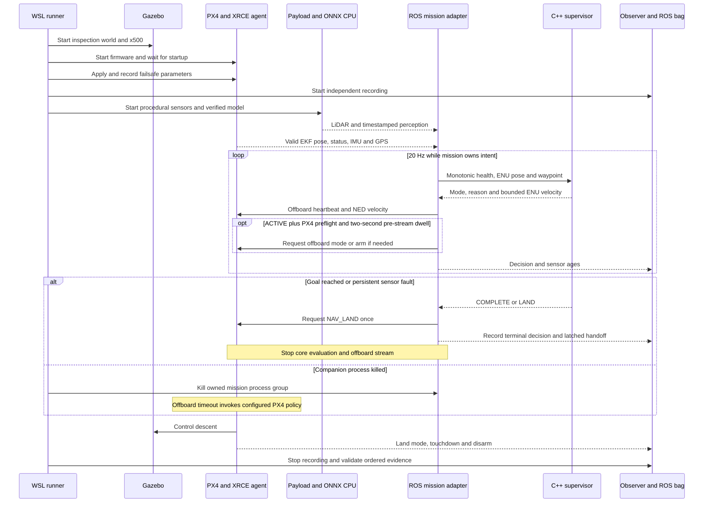

# Run the real PX4 / ROS 2 / Gazebo pipeline in WSL

For the full setup history and step-by-step retest procedure, start with [the complete reproduction guide](complete-reproduction-guide.md). It separates rerunning a prepared environment from rebuilding a fresh one and includes expected output, log-reading commands and every resolved integration issue.

This is the project's integration track. PX4 runs its actual flight firmware as a Linux process; Gazebo Harmonic simulates the x500's dynamics and flight sensors; ROS 2 Humble carries typed payload and control messages. The C++ supervisor supplies mission intent. The simpler, accelerated simulator remains available for fast policy tests.

This setup uses WSL Ubuntu 22.04, CPU ONNX inference and a synthetic payload camera/LiDAR. It does not emulate a Qualcomm SoC, its NPU, secure boot ROM or hardware interfaces. The flight estimator is PX4 EKF2. Losing GPS demonstrates conservative failure handling; it does not demonstrate VIO or successful GPS-denied navigation.

## 1. Prepare the environment

In Windows PowerShell:

```powershell
wsl --list --verbose
wsl -d Ubuntu-22.04
```

Then in Ubuntu:

```bash
cd /mnt/c/src/mission-computer-lab   # your checkout
bash scripts/bootstrap_wsl.sh
bash scripts/run_all.sh
sudo bash scripts/install_sitl_system.sh
bash scripts/build_sitl.sh
```

Substitute your checkout path. If these dependencies are already installed and built, proceed to section 2. The system installer adds the official ROS and OSRF apt repositories and installs ROS Humble, Gazebo Harmonic, the ROS/Gazebo bridge, colcon, OpenCV and build dependencies. It uses `apt-get --no-remove` so a dependency conflict stops instead of silently removing existing packages.

Upstream sources, compiled libraries, the ROS workspace and a Python environment live under `~/work/mission-computer-lab` on WSL's Linux filesystem. This avoids putting the very large PX4 tree and build output on the Windows mount. The small project source remains in this repository. Reserve several GB of free storage and allow substantial first-build time. The development machine had approximately 15 GB of memory available to WSL; the build uses three compiler jobs.

The build selects PX4 v1.16.0 and XRCE Agent v2.4.3. PX4 message definitions use the matching `release/1.16` family. Exact tested commits appear in the execution evidence. Do not mix a different firmware message layout with an arbitrary `px4_msgs` branch. The build script creates two ROS packages: upstream `px4_msgs` and this project's `mission_interfaces`.

## 2. Run one mission before running faults

```bash
bash scripts/run_sitl.sh --scenario nominal --output artifacts/my-sitl-nominal
```

Use a fresh, empty output directory for each attempt. The runner refuses nonempty output directories, including old summaries. For long recordings prefer WSL's Linux filesystem, for example `--output ~/work/mission-computer-lab/retests/flight-001`; a `/mnt/c` live-log run encountered an OS I/O failure during review. It starts only its own child processes and cleans them up at the end. Run one instance at a time: the flight controller uses instance 0, XRCE port 8888, and a local MAVLink GCS port 14550. `ROS_DOMAIN_ID=42` separates this lab from typical ROS workspaces; it is not authentication or network isolation. The tested DDS setup uses normal participant discovery because `ROS_LOCALHOST_ONLY=1` prevented discovery of the agent's PX4-created participant. Use an isolated development network and do not attach flight hardware to this simulation setup.

The launcher starts Gazebo headlessly, attaches PX4 to `x500_0` in the `inspection` world, waits for the startup script, applies and records the final simulation parameters, then starts the payload, perception, mission and observation processes. A separate minimal MAVLink GCS process sends heartbeats and receives PX4 heartbeats. It does not send flight commands. ROS 2/DDS carries offboard commands.

Expected mission sequence:

1. Gazebo creates the floor, three cylindrical obstacles and the x500.
2. PX4 starts flight sensors and EKF2; the agent exposes firmware telemetry to ROS.
3. A user-space model verification gate checks the ONNX artifact; ONNX Runtime opens a CPU session.
4. The payload publishes RGB images and planar laser scans at 10 Hz. The perception node publishes typed inference results retaining the image capture timestamp.
5. The mission node obtains a valid local estimate, computes an inflated occupancy map and A* path, then gives the C++ supervisor time-stamped samples at 20 Hz.
6. Offboard proof-of-life and velocity setpoints stream before the adapter requests offboard mode and arm. PX4's own checks decide whether to accept them.
7. The vehicle climbs to 3 m, follows the route to the inspection goal, receives a land command and disarms after landing.
8. The independent observer and runner evaluate recorded telemetry. A successful command request alone does not count as successful flight.

## 3. Exercise failures

The sequence separates mission intent from PX4's ownership of the actual vehicle. Logs and ROS bags observe both sides.



```bash
bash scripts/run_sitl.sh --all --output artifacts/my-sitl-matrix
```

The matrix stops at the first failed scenario so its logs can be investigated. Alternatively select `camera_dropout`, `companion_crash` or `gps_loss` with `--scenario`.

| Scenario | Injection boundary | Evidence to inspect |
|---|---|---|
| Nominal | No deliberate fault | Arm acknowledgment, offboard state, climb, route completion, PX4 land state and disarm |
| Camera dropout | Payload stops publishing images for 0.8 seconds | Perception timestamp becomes stale; C++ emits HOLD; fresh frames plus recovery dwell allow ACTIVE again |
| Companion crash | Runner sends SIGKILL to the mission process group, including C++ | Independent observer survives; PX4 detects lost offboard proof-of-life and applies its own land policy |
| GPS loss | Set the Gazebo bridge's `SIM_GPS_USED=0` through PX4 | Observed invalid GPS fix, rejection of fresh-but-invalid packets, HOLD then LAND, land and disarm |

The camera and LiDAR are **procedural ROS payload sensors**, not rendered Gazebo camera/lidar plugins. The camera contains a moving bright synthetic shape; the ONNX graph segments brightness. This deliberately small model tests artifact, tensor, timing and communication contracts. It has no trained class semantics, and its bounding box does not steer toward an aerial target. The inspection route is independent of object identity.

## 4. Follow the interfaces

| Producer → consumer | Interface | Contract |
|---|---|---|
| Gazebo → PX4 | PX4 Gazebo bridge | Physics, IMU, magnetometer, pressure and GNSS feed actual firmware |
| PX4 → ROS | uXRCE-DDS agent, UDP 8888 | Matching message schemas; output subscriptions use best-effort sensor QoS |
| Payload → perception | `/mission/camera/image`, `sensor_msgs/Image` | RGB8, 64×48, 192-byte row stride, capture timestamp |
| Payload → planner | `/mission/lidar/scan`, `sensor_msgs/LaserScan` | 72 planar world-aligned rays, 14 m range, 10 Hz |
| Perception → mission | `/mission/perception`, `mission_interfaces/Perception` | Sequence, source stamp, bounding box, inference duration, model hash and execution provider |
| Mission ↔ C++ | Line-oriented stdin/stdout | Sequence validation, finite values and bounded intent; subprocess timeout is fatal |
| Mission → PX4 | `OffboardControlMode`, `TrajectorySetpoint`, `VehicleCommand` | Velocity control at 20 Hz, unused setpoint fields NaN, explicit arm/mode/land requests |
| Mission → observer | `/mission/decision`, `mission_interfaces/Decision` | Mode/reason, ENU pose/target/velocity, sensor ages and waypoint index |

PX4 local position is NED: north, east, down. Application coordinates are ENU: east, north, up. Position is referred to the initial valid local estimate; velocity converts as `[north,east,down] = [enu_y,enu_x,-enu_z]`. The payload LiDAR is explicitly world-aligned; a physical body-frame scanner would need calibrated transforms, orientation and motion compensation. Some PX4 topics carry a `_v1` suffix; `px4_topic()` derives this from the message's `MESSAGE_VERSION` constant.

Do not compare PX4 boot microseconds directly with ROS wall-clock seconds. The mission adapter tracks monotonic receipt time only when a firmware source timestamp advances. Image and scan source stamps must advance and cannot be in the future; their capture age is converted to a fixed monotonic timestamp on receipt. Mission deadlines therefore do not follow ROS wall-clock jumps. Repeating an old PX4 sample cannot refresh health. A new GPS packet also requires a 3-D fix and valid NED velocity to refresh navigation health. High-rate position receipt monitors the link; approximately 2 Hz vehicle status has a separate 1.5-second freshness bound. This single-host experiment does not validate a distributed clock synchronization design.

The initial occupancy map is static. Payload scan geometry is generated from the same idealized obstacle configuration used by the world. Sensor occlusion, reflective materials, rolling shutter, calibration error and moving-obstacle avoidance are outside this experiment. EKF position telemetry is an estimate, not Gazebo ground truth; a clearance calculation from that estimate is not a certified collision guarantee.

## 5. Inspect the evidence

The output root also contains `provenance.json`: versions and source/binary hashes captured before flight, plus a post-run unchanged-input check. Publication uses this saved record. Each scenario directory contains:

- `result.json`: acceptance checks, status transitions, command acknowledgments, message counts, position trace and decisions.
- `observer.jsonl`: independent firmware and ROS observations, including after a mission crash.
- `mission.jsonl`: A* plan, supervisor transitions, selected decisions and outgoing commands.
- `perception.jsonl`: model/provider evidence and inference measurements.
- `parameters.log`: final configured failsafe parameters read back from PX4.
- `rosbag/`: recorded typed decision, perception and LiDAR topics.
- Per-process `.log` files, plus `gps-injection.log` in the GPS-loss case.

Acceptance requires an ordered armed-offboard → airborne → armed-land-mode → touchdown → disarm sequence, a valid final vertical estimate near the ground, and recorded messages on all three selected bag topics. GPS-loss may invalidate horizontal localization after the recorded injection; pre-injection validity and final vertical validity remain required. Clearance is computed only while the position estimate is valid. Arm and land ACKs alone cannot establish those outcomes.

PX4 ULog files remain under the corresponding `~/work/mission-computer-lab/runs/` directory. Large bags, ULogs and upstream builds are not committed. The published sample contains compact evidence and a replay. A replay is a recorded run, not a live flight console.

To inspect a bag in a new WSL terminal:

```bash
source /opt/ros/humble/setup.bash
source ~/work/mission-computer-lab/ros_ws/install/setup.bash
ros2 bag info artifacts/my-sitl-nominal/nominal/rosbag
```

Do not replay command topics into a running controller. This recorder selects application evidence topics only; it does not record command topics for automatic playback.

## 6. Understand the failsafe ownership

The C++ supervisor reacts to stale data with HOLD and escalates a sustained or repeatedly recurring fault to LAND; a fault episode ends only after 2 s of continuous health. It has a healthy-data dwell before initial activation and recovery. The ROS adapter stops commanding if PX4 enters a failsafe, invalidates its local estimate, disarms after a flight, or leaves OFFBOARD because a pilot or GCS changed mode. It does not automatically rearm or switch back to OFFBOARD after any of these.

The perception node starts only after verifying the model file against a detached signed manifest and a public key supplied by the runner; it then loads the verified bytes rather than reopening the file. An unsigned or modified model stops the node, and the runner reports the scenario as failed.

PX4 separately requires offboard proof-of-life. The run configures `COM_OF_LOSS_T=0.5`, `COM_OBL_RC_ACT=4` (Land), and `COM_FAIL_ACT_T=0`. These are simulation choices, recorded and checked for the tested firmware. `COM_RC_IN_MODE=4` disables manual RC input in this headless lab, while `NAV_DLL_ACT=2` retains GCS-loss RTL behavior. Never copy this configuration directly to an aircraft.

If the companion process is killed, its own watchdog cannot save anything. The independent PX4 controller must notice missing proof-of-life and execute the fallback. This is the most important demonstration: two computers have different responsibilities and different failure domains.

## 7. Troubleshoot from evidence

| Symptom | Check and explanation |
|---|---|
| Missing `etc/init.d-posix/rcS` | PX4's positional resource argument must be the build's `etc` directory; the launcher creates a separate writable runtime directory. |
| Payload messages work but no `/fmu/out` telemetry | Check DDS domain, the agent process and `ROS_LOCALHOST_ONLY`. The latter caused a reproducible discovery failure here. |
| Arming denied | Read `px4.log`, command ACKs and final parameters. Startup defaults can overwrite early environment overrides; the launcher reapplies its policy after startup. |
| Build cannot find OpenCV | The system installer includes `libopencv-dev`; PX4's Gazebo plugins require it. |
| NuttX version generation fails in a SITL build | The PX4 version generator still reads NuttX tags. The build script fetches the tag required by this pinned checkout. |
| CMake compatibility errors | Use `/usr/bin/cmake` from Ubuntu 22.04, as selected in the build script; a separately installed CMake 4 changed policy behavior. |
| Python message cannot be serialized to JSON | Convert fixed-array numpy scalars to native `float` before writing evidence. This was caught in the first telemetry run. |
| Mission remains on ground | Verify arm ACK, status, estimator validity and setpoints; process startup and an ACTIVE application state are insufficient evidence of takeoff. |
| `failure gps off` times out | PX4 v1.16.0's Gazebo bridge does not handle that generic command here. The verified test uses `SIM_GPS_USED=0`, which sets the published GPS fix invalid in the bridge source. |
| Timeout or unexpected child exit | Keep the failed output directory, inspect the named process log and rerun into a fresh directory after fixing the cause. |

## 8. Design walkthrough and hardware migration

Trace one image from bytes to tensor to inference result to the freshness gate. Trace one ENU velocity through its NED conversion and PX4 control mode. Explain why command acceptance, arming, takeoff, landing and disarm are distinct observations. Then kill the mission process and show firmware evidence recorded by a surviving observer.

For Qualcomm, explain the replacement work: BSP and device drivers, camera/ISP pipeline, hardware timestamping, supported QNN/QAIRT model conversion, quantization/calibration, operator support, device profiling, thermals, signed boot chain and protected key provisioning. None of those hardware results can be claimed from this WSL run. The project is a way to test these boundaries before hardware arrives.

Primary references: [PX4 ROS 2 guide](https://docs.px4.io/v1.16/en/ros2/user_guide), [Gazebo simulation](https://docs.px4.io/v1.16/en/sim_gazebo_gz/), [offboard control](https://docs.px4.io/v1.16/en/flight_modes/offboard.html), [failure injection](https://docs.px4.io/v1.16/en/debug/failure_injection.html), [ROS Humble installation](https://docs.ros.org/en/humble/Installation/Ubuntu-Install-Debs.html). Refer to the checked-out firmware source when a parameter's actual behavior differs from a remembered description.
